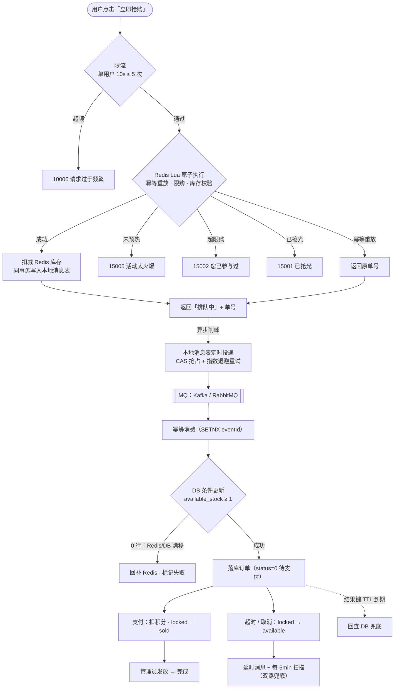
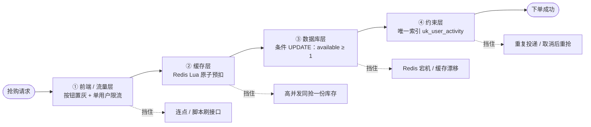
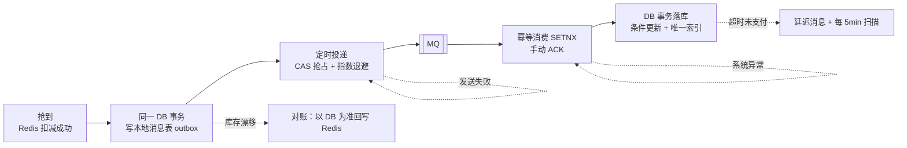

# 校园论坛系统（School Forum）

一个基于 **Vue 3 + Spring Boot 3 / JDK 21** 的校园论坛系统，核心功能为**发帖、点赞、评论**，附加**优惠券秒杀**模块。

本仓库当前阶段为：设计文档、数据库表结构、基础设施（统一响应 / 异常 / JWT 认证骨架 / 可插拔 MQ 抽象 / 本地消息表）均已落地，业务侧实现了**注册登录、发帖、评论、点赞。秒杀**链路，并配套 Vue 3 前端。

---

## 📁 仓库结构

```
school-forum/
├── README.md                                  本文件
├── docs/
│   ├── 01-需求分析.md                          需求分析说明书
│   ├── 02-架构设计.md                          架构设计说明书
│   ├── 03-功能设计.md                          功能设计说明书
│   ├── 04-数据库设计.md                        数据库设计说明书
│   └── 05-消息中间件选型对比方案.md              Kafka vs RabbitMQ 性能对比实验方案
├── sql/
│   ├── 01-schema.sql                          建表 DDL
│   └── 02-init-data.sql                       初始化种子数据
├── docker/
│   └── docker-compose.yml                     MySQL / Redis / RabbitMQ / Kafka 及两个 Web UI
├── pom.xml                                    聚合 POM
├── forum-common/                              通用返回体、异常、常量、工具
├── forum-infrastructure/                      Web 配置、认证骨架、MQ 抽象、本地消息表
├── forum-user/                                用户与认证：注册、登录、刷新、登出、UserApi
├── forum-forum/                               论坛主体：板块、帖子、评论、点赞、浏览数回写
├── forum-notification/                        通知
├── forum-seckill/                             秒杀
├── forum-admin/                               后台管理
├── forum-boot/                                启动模块 + 配置 + ArchUnit 架构测试
└── frontend/                                  Vue 3 前端（Vite / Pinia / Router / Element Plus）
```

---

## 🚀 快速开始

### 1. 初始化数据库

```bash
# --default-character-set=utf8mb4 不能省：
# 脚本是 UTF-8 编码，而 mysql 客户端在 Windows 上默认按控制台代码页（GBK）解释输入。
# 不加这个参数，中文注释和种子数据会被静默写成双重编码的乱码——不报错，但查出来全是乱码。
mysql -u root -p --default-character-set=utf8mb4 < sql/01-schema.sql
mysql -u root -p --default-character-set=utf8mb4 < sql/02-init-data.sql
```

> 用 Docker 起 MySQL（推荐）时无需手动导入：`sql/` 已挂载到容器的
> `docker-entrypoint-initdb.d`，首次启动自动按序执行，详见 `docker/README.md`。

**环境要求**：MySQL 8.0.30+（依赖 ngram 全文索引、降序索引、JSON 类型）。

若中文全文检索报错，检查分词器配置：

```sql
SHOW VARIABLES LIKE 'ngram_token_size';   -- 应为 2
```

### 2. 种子账号

初始化脚本创建了 5 个测试账号，密码均为 `123456`：

| 用户名 | 昵称 | 角色 | 说明 |
|---|---|---|---|
| `admin` | 系统管理员 | 管理员 | 可访问 `/api/admin/**` |
| `zhangsan` | 张三 | 普通用户 | 考研帖作者 |
| `lisi` | 李四 | 普通用户 | 二手市场 |
| `wangwu` | 王五 | 版主 | 求职实习版主 |
| `zhaoliu` | 赵六 | 普通用户 | 大一新生 |


### 3. 验证状态

`sql/` 下的两个脚本已在 **MySQL 8.4.11** 上实际执行验证，非仅静态编写：

| 验证项 | 结果 |
|---|---|
| `01-schema.sql` 建表 | ✅ 通过，生成 23 张表，无错误 |
| `02-init-data.sql` 种子数据 | ✅ 通过，行数与预期一致（5 用户 / 8 板块 / 14 标签 / 8 帖子 / 16 评论 / 19 点赞） |
| 脚本内置的 4 项数据自洽性校验 | ✅ 全部返回空集（库存恒等式、点赞数一致、评论数一致、二级评论 root_id 合法） |
| ngram 中文全文检索 | ✅ `考研`、`闲置 教材` 均正确命中，`量子力学` 正确返回空 |
| 点赞幂等（`uk_user_target`） | ✅ 重复点赞被拦截，报 `Duplicate entry` |
| 秒杀防重复下单（`uk_user_activity`） | ✅ 重复下单被拦截，报 `Duplicate entry` |
| 秒杀防超卖（条件 UPDATE） | ✅ 库存为 0 时 `affectedRows = 0`，库存未被扣成负数，恒等式仍成立 |
| 14 条关键查询的索引命中 | ✅ 全部命中预期索引，无 `Using filesort` |

> **过程中的一处设计修正**：实测发现游标分页查询产生 `Using filesort`，根因是 `t_post` 的列表索引末尾缺少 `id DESC`（InnoDB 二级索引隐式包含的主键方向固定为 ASC，与 `ORDER BY ... , id DESC` 不匹配）。已在所有相关索引末尾补 `id DESC`，并把「置顶帖从列表查询中剥离」以消除 `type` 范围条件导致的排序退化。完整分析与实测对照见《[04-数据库设计](docs/04-数据库设计.md)》1.5 节。

### 4. 启动应用

```bash
# 1) 起依赖：MySQL / Redis / RabbitMQ / Kafka（表结构与种子数据由 MySQL 容器首次启动时自动导入）
docker compose -f docker/docker-compose.yml up -d

# 2) 构建（ArchUnit 架构测试会在这一阶段跑，模块边界放错会直接构建失败）
mvn -B clean install

# 3) 启动后端，监听 8080，context-path 为 /api
java -jar forum-boot/target/school-forum.jar

# 4) 启动前端，监听 5173，/api 已代理到 8080
cd frontend && npm install && npm run dev
```

打开 <http://localhost:5173> 即可注册登录。默认使用 RabbitMQ 作为消息中间件，切换 Kafka 只需改 `application.yml` 中的 `forum.mq.provider`，业务代码无需改动。

---

## 🎯 项目亮点

### 1. 可插拔的消息中间件抽象层

项目**同时实现了 Kafka 与 RabbitMQ 两套异步方案**，通过统一抽象层隔离：

```java
// 业务代码只依赖接口，完全不知道底下是哪个 MQ
private final EventPublisher eventPublisher;
```

切换只需改一行配置：

```yaml
forum:
  mq:
    provider: rabbitmq   # kafka | rabbitmq
```

**设计目的**：为「Kafka 还是 RabbitMQ 更适合本项目」这个问题提供**可实测的答案**，而不是依赖网上的泛泛之谈。完整的对比实验方案见 [`docs/05-消息中间件选型对比方案.md`](docs/05-消息中间件选型对比方案.md)。

架构约束由 ArchUnit 在编译期强制保证 —— **业务模块不得直接依赖任何 MQ 客户端 API**。

### 2. 分级一致性策略

不是无脑上最终一致，而是按「用户是否能感知」来分级：

| 数据 | 一致性 | 理由 |
|---|---|---|
| 评论内容 | **强一致**（同步落库） | 用户写的字，丢了不可挽回 |
| 点赞 | **最终一致**（异步落库） | 只是一个关系，延迟 1 秒无感 |
| 秒杀库存 | 最终一致 + 定期对账 | 必须防超卖，但可容忍短暂偏差 |

### 3. 秒杀链路与四层防护

**主链路**：同步段只做「准入」，真正落库交给 MQ 异步完成，接口 P99 < 50ms。



**四层防护落位（纵深防御）**：请求自上而下依次穿过四道闸门，任何一层单独失效都不会导致超卖或重复下单。



**消息不丢的可靠链**：本地消息表 + 幂等消费 + 手动 ACK + 定时兜底。



**四层防护 ↔ 极端场景对照**：

| 防护层 | 单独失效时兜住什么 | 保障「不超卖」的极端场景 | 对「消息不丢」的作用 |
|---|---|---|---|
| **① 前端置灰 + 单用户限流** | 把 1 次抢购放大成 N 次 | 用户连点、脚本高频刷接口，把洪峰削到 Lua 可承受量级 | —（削峰，非正确性防线） |
| **② Redis Lua 原子预扣** | 单线程内一次原子执行，判定与扣减不可分割 | 瞬时万级并发同抢**同一件**库存，只有 `DECR` 到 0 前的那批能过 | 扣减成功即生成唯一单号，作为消息/订单的幂等键 |
| **③ DB 条件 UPDATE** | `WHERE available_stock >= 1`，命中 0 行即回补 | **Redis 宕机 / 主从切换 / 数据被清 / 缓存与 DB 漂移**——库存不可能扣成负数 | 落库失败不影响消息本身，消息仍留在 outbox 待重试 |
| **④ 唯一索引** | `uk_user_activity` / `uk_order_no`，重复只落一单 | Redis 判重键失效、取消后重抢、**消息重复投递** | 消费可安全重试 →「至少一次」不会变成重复订单 |

消息不丢不是靠单层，而是靠这条链：`② 的 outbox 写入`（扣了库存就一定有消息）→ `CAS 抢占 + 退避重试`（发送失败可重投）→ `幂等消费 + 手动 ACK`（处理成功才提交位点）→ `超时双路 + 库存对账`（最终兜底）。

库存采用三层模型：

```
total_stock = available_stock + locked_stock + sold_count
```

该恒等式是所有对账任务的校验基准。

> **设计取向：宁可少卖，不可超卖。** 四层闸门能保证不超卖、不重复下单、结果最终可查；代价是极小概率下存在「丢单窗口」（预扣成功到写 outbox 之间崩溃 / Kafka 累计不可用约 30s / 消费者侧 MySQL 累计不可用约 6s），此时方向始终是少卖而非超卖，由对账任务修正。

### 4. 全链路埋点内建

`t_mq_consume_log` 表同时承担**消费幂等**与**性能埋点**两个职责，`provider` + `cost_ms` 两列使得 MQ 性能对比无需额外压测工具即可完成聚合查询。

---

## 📊 核心设计速览

### 数据库（23 张表）

| 领域 | 表 |
|---|---|
| 用户域 | `t_user`、`t_user_follow` |
| 论坛域 | `t_board`、`t_post`、`t_post_content`、`t_comment`、`t_user_like`、`t_user_collect`、`t_tag`、`t_post_tag` |
| 通知域 | `t_notification` |
| 营销域 | `t_coupon`、`t_seckill_activity`、`t_user_coupon`、`t_seckill_order` |
| 基础设施 | `t_mq_message`、`t_mq_consume_log`、`t_mq_benchmark_result` |

**几个值得关注的设计**：

- **`t_post` + `t_post_content` 垂直分表** —— 正文大字段独立，列表页查询可完全走索引，Buffer Pool 有效容量提升约 25 倍
- **`t_comment` 两级评论模型** —— `root_id` 使「取某条评论的全部回复」变成一次索引查询，无需递归
- **`t_user_like` 统一点赞表** —— 帖子与评论点赞共用一套代码，扩展新对象零成本
- **`uk_user_activity` 唯一索引** —— 秒杀防重复下单的最后一道防线


---
