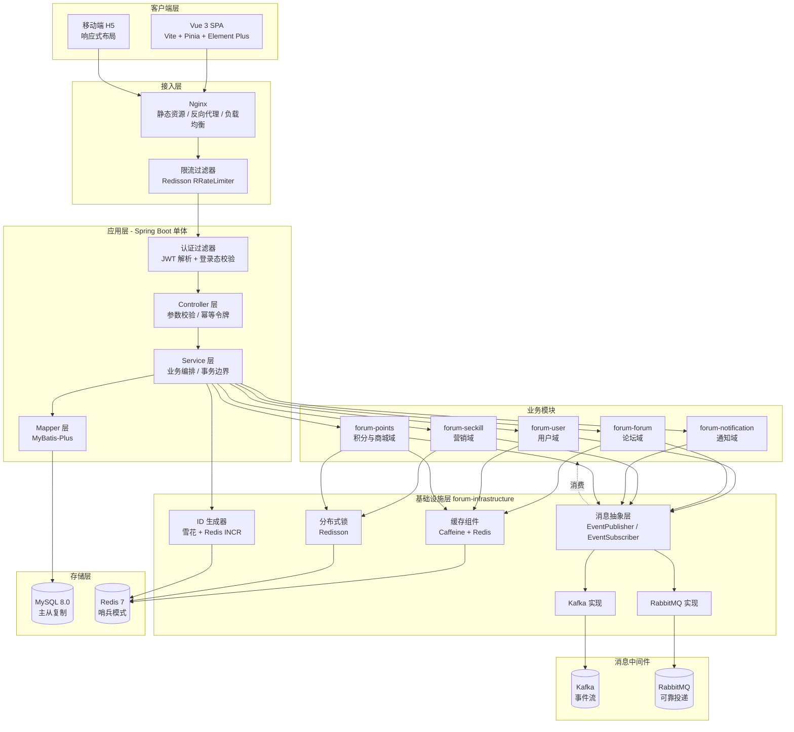
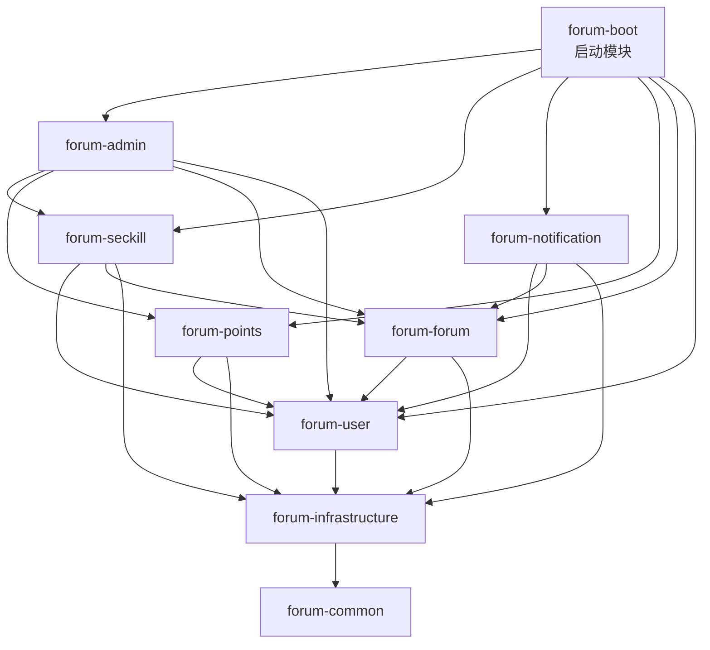
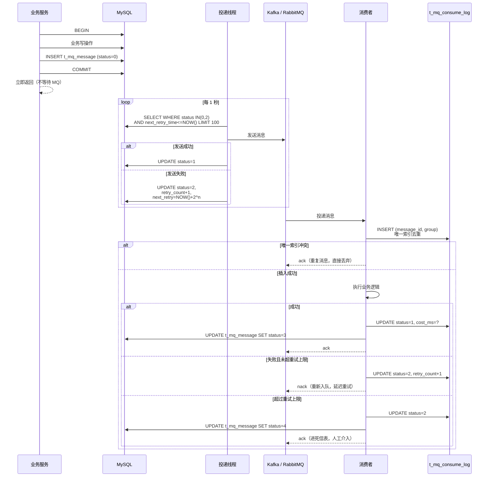
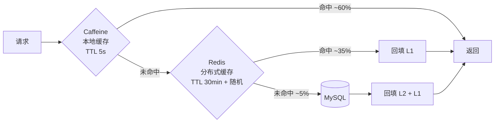
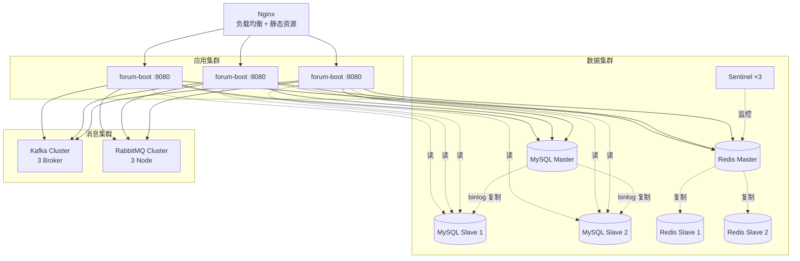
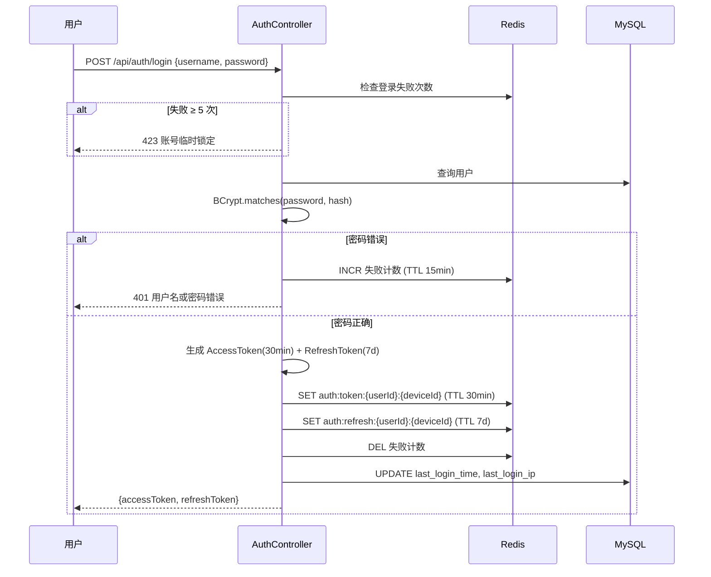

# 校园论坛系统 —— 架构设计说明书

| 项目 | 内容 |
|---|---|
| 架构形态 | 单体多模块（Modular Monolith） |
| 运行环境 | JDK 21 / Spring Boot 3.3.x |
| 文档版本 | V1.0 / 2026-09-14 |

---

## 1. 架构目标与设计原则

### 1.1 架构目标

| 目标 | 具体含义 | 对应设计 |
|---|---|---|
| **读写分离的关注点隔离** | 高频读（列表、详情）与高频写（点赞）用完全不同的技术路径 | CQRS 思想：读走多级缓存，写走 Redis + 异步落库 |
| **异步逻辑中间件无关** | 同一套业务异步逻辑可在 Kafka / RabbitMQ 间零代码切换 | 统一消息抽象层（本文第 6 节） |
| **热点隔离** | 秒杀流量不得影响论坛主流程 | 独立线程池 + 独立连接池 + MQ 削峰 |
| **数据不丢** | 异步不代表可以丢数据 | 本地消息表 + 幂等消费 + 对账任务三重保障 |
| **可平滑演进** | 当前是单体，但要能低成本拆分 | 模块间通过接口通信，不跨模块直接访问表 |

### 1.2 设计原则

**P1. 用户能感知的用强一致，感知不到的用最终一致**

这是贯穿全项目的最高原则。评论内容必须同步落库（用户刷新页面必须看到）；点赞数可以延迟 1 秒（用户看不出差别）。用错这一条，系统要么又慢又复杂，要么又不可靠。

**P2. 缓存是真相，数据库是底线**

点赞数、库存、浏览量的**实时真相在 Redis**，MySQL 只是持久化与容灾的底线。所有读取走 Redis，所有对账以 MySQL 为准。明确这一点后，「Redis 数据丢了怎么办」就不再是设计缺陷，而是对账任务的职责。

**P3. 每一层都假设上一层会失效**

防超卖不能只靠 Redis（Redis 会挂），不能只靠唯一索引（并发下会打满）。**四层防护各有职责，任何一层单独失效都不会导致业务错误**。同理，消息投递假设会丢（本地消息表），消费假设会重复（幂等日志表）。

**P4. 抽象放在变化的地方，不放在稳定的地方**

两个 MQ 是变化点 → 抽象成接口；业务逻辑是稳定的 → 不抽象，直接写。**过度抽象比不抽象更贵**。本项目只对消息层做抽象，数据访问、缓存、鉴权都直接使用成熟框架的 API。

**P5. 不为假想的规模做设计**

校园论坛 5 万用户，不做微服务、不引入注册中心、不上分库分表。但**保留演进路径**：模块边界清晰、分片键已选定、迁移方案已文档化。设计文档里写清「什么时候该做」，比现在就做更重要。

---

## 2. 总体架构

### 2.1 分层架构图



### 2.2 请求处理路径

**读路径（帖子列表）**

```
浏览器 → Nginx → 限流 → JWT 校验
  → Controller → Service
      → Caffeine 本地缓存（命中则返回，TTL 5s）
      → Redis 缓存（命中则回填本地缓存后返回）
      → MySQL 查询 → 回填 Redis + 本地缓存
  → 返回
```

**写路径（点赞）**

```
浏览器 → Nginx → 限流 → JWT 校验
  → Controller → Service
      → Redis Lua（判重 + 计数 + 集合写入，原子完成）
      → 写本地消息表（事务内）
      → 事务提交
      → 投递线程异步发 MQ
  → 立即返回（耗时约 5–15ms）

  ↓（异步）
  MQ → 消费者 → 批量聚合 → MySQL 落库 + 计数更新
```

**秒杀路径**

```
浏览器 → Nginx → 限流 → JWT 校验
  → Controller → Service
      → Redis Lua（判重 + 扣库存，原子完成）
      → 写本地消息表
  → 返回「排队中」（耗时约 3–10ms）

  ↓（异步）
  MQ → 消费者 → 创建订单 + DB 库存扣减 → 通知结果
```

---

## 3. 技术选型

### 3.1 后端

| 组件 | 选型 | 版本 | 选型理由 |
|---|---|---|---|
| 语言 | Java | 21 (LTS) | Record 简化 DTO、虚拟线程承载高并发 IO、模式匹配提升可读性 |
| 框架 | Spring Boot | 3.3.x | 生态成熟；3.x 全面迁移到 Jakarta 命名空间，面向未来 |
| Web | Spring MVC | — | 阻塞式模型配合虚拟线程（`spring.threads.virtual.enabled=true`）即可达到异步框架的吞吐，代码却简单得多 |
| 安全 | JWT + 自研拦截器 | — | 本项目无表单登录 / OAuth2 / 会话管理需求，引入 Spring Security 只为用其中一小部分，反而让「请求为何被拒绝」变难排查。详见 **ADR-009** |
| ORM | MyBatis-Plus | 3.5.x | 单表 CRUD 零 SQL；复杂查询仍可手写 SQL，不受 ORM 抽象泄漏之苦 |
| 连接池 | HikariCP | — | Spring Boot 默认，性能最佳 |
| 缓存 | Caffeine + Redis | — | Caffeine 抗热点（本地、纳秒级），Redis 做分布式共享层 |
| 分布式锁 | Redisson | 3.3x | 提供看门狗自动续期、可重入锁、限流器，避免手写 SETNX 的坑 |
| 消息 | Kafka + RabbitMQ | — | 双实现对比（见《05-消息中间件选型对比方案》） |
| ID 生成 | 雪花算法 | — | 趋势递增，对 B+ 树友好；MyBatis-Plus 内置 |
| 参数校验 | Jakarta Validation | — | 声明式校验，注解即文档 |
| 对象映射 | MapStruct | 1.5.x | 编译期生成，零反射开销 |
| 文档 | SpringDoc OpenAPI | 2.x | 自动生成，与 Spring Boot 3 兼容 |
| 日志 | Logback + MDC | — | 链路 ID 贯穿全链路 |
| 监控 | Actuator + Micrometer + Prometheus | — | 业务指标与 JVM 指标统一采集 |

> **实施阶段的选型调整**（与上表的差异记录在此，避免文档与代码对不上）：
> 对象映射未引入 MapStruct（本项目的 VO 需要聚合帖子 + 作者 + 标签 + 点赞态等多源数据，
> 注解映射反而更绕，改用 `convert/` 包下的静态方法）；
> 富文本未引入 md-editor-v3（用 textarea + `marked` + `DOMPurify` 即可满足当前需求）；
> 样式未引入 UnoCSS。以上三项都不影响架构约束，调整理由都是**当前规模下收益不抵复杂度**，
> 与 P5「不为假想的规模做设计」一致。

### 3.2 前端

| 组件 | 选型 | 理由 |
|---|---|---|
| 框架 | Vue 3.4 | Composition API 逻辑复用更自然；`<script setup>` 写法简洁 |
| 构建 | Vite 5 | 开发态冷启动秒级，HMR 极快 |
| 状态 | Pinia | Vue 3 官方推荐，TypeScript 支持好，无 mutations 样板代码 |
| 路由 | Vue Router 4 | 支持路由级懒加载与导航守卫 |
| UI | Element Plus | 组件齐全，中文文档完善 |
| 请求 | Axios | 拦截器统一处理 Token 刷新与错误提示 |
| 富文本 | md-editor-v3 | Markdown 编辑器，支持图片上传与预览 |
| 样式 | UnoCSS | 原子化 CSS，按需生成，体积小 |

### 3.3 中间件与存储

| 组件 | 版本 | 用途 | 关键配置 |
|---|---|---|---|
| MySQL | 8.0.30+ | 主存储 | `innodb_buffer_pool_size` = 物理内存 60%；`ngram_token_size=2` 支持中文全文检索 |
| Redis | 7.x | 缓存、计数、库存、分布式锁 | 哨兵模式（1 主 2 从 3 哨兵）；`maxmemory-policy=allkeys-lru` |
| Kafka | 3.6.x | 高吞吐事件流 | 3 分区起；`acks=1`（压测时对比 `acks=all`） |
| RabbitMQ | 3.12.x | 可靠投递与延迟消息 | 镜像队列；`publisher-confirm` + `publisher-return` 开启 |

---

## 4. 模块划分

### 4.1 Maven 多模块结构

```
school-forum/                          [parent pom - 依赖版本统一管理]
├── forum-common/                      通用基础，不依赖任何业务模块
│   ├── result/                        Result<T>、PageResult<T>、ErrorCode
│   ├── exception/                     BizException、全局异常处理器
│   ├── constant/                      Redis Key 常量、MQ Topic 常量、枚举
│   ├── util/                          JsonUtil、DateUtil、SnowflakeIdUtil
│   └── validation/                    自定义校验注解
│
├── forum-infrastructure/              基础设施，被所有业务模块依赖
│   ├── config/                        RedisConfig、RedissonConfig、MyBatisPlusConfig、
│   │                                  KafkaConfig、RabbitMQConfig、线程池配置
│   ├── mq/                            ★ 消息抽象层（本文第 6 节）
│   │   ├── EventPublisher.java        统一发布接口
│   │   ├── EventSubscriber.java       统一订阅接口
│   │   ├── event/                     BaseEvent、LikeChangedEvent、PostCreatedEvent...
│   │   ├── kafka/                     KafkaEventPublisher / KafkaEventSubscriber
│   │   ├── rabbitmq/                  RabbitMqEventPublisher / RabbitMqEventSubscriber
│   │   └── reliable/                  本地消息表 + 投递线程 + 幂等消费切面
│   ├── cache/                         CacheService、MultiLevelCache、BloomFilterHelper
│   ├── lock/                          DistributedLockTemplate
│   ├── idgen/                         IdGenerator（雪花 / Redis INCR）
│   └── metric/                        MqMetrics、BizMetrics
│
├── forum-user/                        用户域
│   ├── controller/                    AuthController、UserController、FollowController
│   ├── service/                       AuthService、UserService、FollowService
│   ├── mapper/                        对应 t_user、t_user_follow
│   └── api/                           UserApi（供其他模块调用的内部接口）
│
├── forum-forum/                       论坛域（板块、帖子、评论、点赞、标签）
│   ├── controller/                    BoardController、PostController、
│   │                                  CommentController、LikeController、TagController
│   ├── service/
│   ├── mapper/
│   ├── consumer/                      PostEventConsumer、LikeEventConsumer
│   └── api/                           PostApi、CommentApi
│
├── forum-notification/                通知域
│   ├── controller/                    NotificationController
│   ├── service/                       NotificationService、NotificationAggregator
│   ├── consumer/                      NotificationEventConsumer
│   └── mapper/
│
├── forum-seckill/                     营销域
│   ├── controller/                    CouponController、SeckillController、OrderController
│   ├── service/
│   ├── mapper/
│   ├── consumer/                      SeckillOrderConsumer、OrderTimeoutConsumer
│   ├── lua/                           seckill.lua、stock_rollback.lua
│   ├── task/                          预热任务、状态刷新、库存对账、超时扫描
│   └── api/                           CouponApi
│
├── forum-points/                      积分与商城域
│   ├── controller/                    PointsController（签到/余额/流水）
│   │                                  MallController（商品浏览/兑换/我的订单）
│   ├── service/                       SigninService、PointsAccountService、
│   │                                  MallGoodsService、MallOrderService
│   ├── mapper/                        对应 t_user_points、t_points_record、
│   │                                  t_user_signin、t_mall_goods、t_mall_order
│   ├── lua/                           signin.lua（SETBIT + BITCOUNT 原子签到）
│   ├── task/                          SigninBitmapRepairTask、MonthlySigninBonusTask
│   └── api/                           PointsApi、MallAdminApi（供 forum-admin 调用）
│
├── forum-admin/                       后台管理
│   ├── controller/                    AdminUserController、AdminPostController、
│   │                                  AdminCouponController、AdminActivityController、
│   │                                  AdminMallController、AdminPointsController
│   └── service/                       仅做编排：校验入参 → 调各模块 api 包
│
└── forum-boot/                        启动模块（唯一可执行 jar）
    ├── ForumApplication.java
    └── resources/
        ├── application.yml
        ├── application-dev.yml
        ├── application-test.yml
        └── application-prod.yml
```

### 4.2 模块依赖关系



> **`forum-points` 为什么不并进 `forum-forum`：** 它面向的是「用户行为激励」而不是「内容」，
> 与板块、帖子、评论没有任何共享概念；更关键的是，**它必须能被 `forum-admin` 用 `api` 包调用**
> ——ArchUnit 规定 `forum-admin` 只能触碰其他模块的 `api` 包，
> 若把商城管理逻辑塞进 `forum-forum`，就要给论坛域开一个仅供后台使用的 `api`，
> 让论坛模块承担它本不该有的职责。

**依赖规则（ArchUnit 单元测试强制校验）**：

1. **单向依赖，严禁环**。`forum-common` 不依赖任何模块；`forum-infrastructure` 只依赖 `common`。
2. **业务模块之间只能通过 `api` 包下的接口调用**，不得直接引用对方的 `service`、`mapper` 或实体类。这条规则是未来拆分微服务的唯一前提——只要守住它，把 `forum-seckill` 拆成独立服务时，只需把 `api` 包的实现从本地调用换成 OpenFeign，业务代码不受影响。
3. **不跨模块访问表**。`forum-forum` 不得直接查 `t_user` 表，必须通过 `UserApi.getUserBrief(userId)` 获取用户信息。

`forum-boot` 刻意做成独立模块，使业务模块保持 `jar` 打包（不可执行），只有启动模块打 `jar` 且配置 `spring-boot-maven-plugin`。这避免了每个业务模块都带一份 Spring Boot 启动类的问题。

### 4.3 包命名规范

```
com.school.forum.<模块>.<分层>.<功能>
```

示例：
- `com.school.forum.forum.service.impl.PostServiceImpl`
- `com.school.forum.infrastructure.mq.kafka.KafkaEventPublisher`
- `com.school.forum.seckill.consumer.SeckillOrderConsumer`

---

## 5. 关键架构决策（ADR）

### ADR-001：采用单体多模块而非微服务

**状态**：已采纳

**背景**：项目需要承载论坛与秒杀两类差异很大的业务，秒杀有明显的流量洪峰特征。

**决策**：采用单体多模块（Modular Monolith），模块间以 Maven 依赖 + 接口调用通信，通过 ArchUnit 强制约束模块边界。

**理由**：

| 维度 | 单体多模块 | 微服务 |
|---|---|---|
| 开发效率 | 一次编译启动全部功能 | 需维护多个进程、注册中心、配置中心 |
| 事务一致性 | 本地事务即可，无需 Seata/Saga | 跨服务事务是持久难题 |
| 调试成本 | 单进程，断点直达 | 跨进程调用链排查困难 |
| 部署复杂度 | 一个 jar | N 个服务 + 网关 + 注册中心 |
| 拆分成本 | 边界清晰的话，拆分是机械操作 | — |

**秒杀流量洪峰如何隔离？** 不靠拆服务，靠**资源隔离**：

```java
@Configuration
public class ThreadPoolConfig {

    /** 秒杀专用线程池：与论坛主流程完全隔离，秒杀打满不影响发帖评论 */
    @Bean("seckillExecutor")
    public ThreadPoolExecutor seckillExecutor() {
        return new ThreadPoolExecutor(
            16, 32, 60L, TimeUnit.SECONDS,
            new LinkedBlockingQueue<>(2000),
            new ThreadFactoryBuilder().setNameFormat("seckill-pool-%d").build(),
            // 拒绝策略：不阻塞、不丢弃静默，快速失败并返回「当前参与人数过多」
            new ThreadPoolExecutor.AbortPolicy()
        );
    }

    /** 论坛主流程线程池 */
    @Bean("forumExecutor")
    public ThreadPoolExecutor forumExecutor() { /* ... */ }
}
```

配合 MQ 削峰（10000 QPS 的请求最终只有 1000 次 DB 写入），秒杀对主流程的影响被限制在可接受范围。

**放弃的替代方案**：微服务拆分（开发成本与收益不匹配）；单体 + 秒杀独立服务（引入分布式事务问题，而资源隔离已能解决核心矛盾）。

**何时重新评估**：日活超过 5 万，或秒杀 QPS 超过 5 万，或团队规模超过 8 人。

---

### ADR-002：双层消息抽象（发布/订阅接口分离）

**状态**：已采纳（本项目技术核心）

**背景**：需要在 Kafka 与 RabbitMQ 之间切换并对比性能，**且业务代码必须零改动**。

**决策**：定义 `EventPublisher` 与 `EventSubscriber` 两个接口，两种 MQ 各提供一套实现，通过配置项 `forum.mq.provider` 激活其一。

**详细设计见本文第 6 节。**

**放弃的替代方案**：

| 方案 | 为什么不选 |
|---|---|
| 用 Spring Cloud Stream | 它能统一 RabbitMQ 与 Kafka，但屏蔽掉了中间件特有能力的差异（如 RabbitMQ 的延迟队列），而这些差异恰恰是本次对比实验要测的东西。且 Spring Cloud Stream 的绑定抽象层会引入额外开销，污染压测数据的准确性 |
| 两套代码并行维护 | 业务逻辑写两遍，必然出现行为差异，压测结果不可比 |
| 只实现一种，另一种后补 | 后补时会发现业务代码里已渗入大量特有 API 调用，抽象层形同虚设 |

**关键约束**：抽象层必须统一两者**不保证**的东西——即明确只提供 **at-least-once** 语义，业务侧必须自行幂等。这是 Kafka 与 RabbitMQ 行为一致的部分，也是切换时唯一不会出问题的基础。

---

### ADR-003：Redis 为实时真相，MySQL 为最终真相

**状态**：已采纳

**背景**：帖子点赞数会被高频读取和修改。若每次都读写 MySQL，热点行的行锁会成为瓶颈。

**决策**：
- **写**：Redis 原子操作立即生效，异步落库
- **读**：只读 Redis
- **对账**：定时任务以 MySQL 为准修正 Redis

**风险与应对**：

| 风险 | 应对 |
|---|---|
| Redis 宕机导致计数丢失 | 冷启动时从 MySQL 重建；对账任务兜底 |
| Redis 与 MySQL 长期漂移 | 每日全量对账 + 实时偏差告警 |
| 用户取消点赞后立即点赞，异步乱序 | 消息携带 `action` + 时间戳，消费端比较时间戳拒绝过期消息 |

---

### ADR-004：秒杀采用「Redis 预扣 + MQ 异步下单」

**状态**：已采纳

**决策**：请求路径上只做 Redis Lua 原子预扣，DB 落库全部异步。

**为什么不直接查库扣减？** 10000 QPS 直接打 MySQL，即使 `UPDATE ... WHERE stock >= 1` 也只支持约 1000 TPS，且会因行锁排队导致响应时间雪崩。

**为什么用 Lua 而不是 Redisson 分布式锁？** 锁是「串行化」思路，同一活动的所有请求排队执行，吞吐受锁获取/释放开销限制。Lua 在 Redis 单线程内原子执行，无网络往返、无锁开销，10 万 QPS 级别轻松应对。**锁的正确用法是保护复杂临界区，而不是替代原子操作。**

**代价**：用户下单后不能立即看到订单，需要「排队中」的中间态。这是可接受的——秒杀场景下用户对短暂等待有心理预期。

---

### ADR-005：点赞表采用统一表而非按目标分表

**状态**：已采纳

**决策**：`t_user_like` 用 `target_type` 区分帖子与评论点赞。

**详细论证见《04-数据库设计》第 4.4 节。** 核心权衡是：牺牲一点索引紧凑性，换取代码完全复用与零成本扩展新点赞对象。

---

### ADR-006：评论同步落库，点赞异步落库

**状态**：已采纳

**决策**：同为互动功能，但一致性策略相反。

**详细论证见《01-需求分析》第 4.4 节。** 根本判据是**内容是否承载用户创作**：评论是用户写的字，丢了无法挽回；点赞只是一个关系，丢了可以重来。

---

### ADR-007：签到用 Redis Bitmap 去重，MySQL 仍是最终真相

**状态**：已采纳

**背景**：签到需要两个能力——「判断今天签过没有」和「统计本月签了几天」。前者要求幂等，后者是月度奖励的输入。每人每天最多产生一行数据，一年下来是全站写入量最大的一类记录。

**备选方案**：

| 方案 | 幂等判断 | 月度统计 | 单用户单月存储 | 结论 |
|---|---|---|---|---|
| MySQL 单行 + 唯一索引 | 唯一索引冲突（**以异常形式**） | `COUNT(*)` 走索引 | ~50 B | 可行，但每日写入集中在同一时刻 |
| Redis `SET` 存日期字符串 | `SISMEMBER` | `SCARD` | ~1.5 KB | 内存放大 375 倍 |
| **Redis Bitmap** | `SETBIT` **返回值** | `BITCOUNT` | **4 B** | 采纳 |

**决策**：签到位图 key 为 `forum:points:signin:{userId}:{yyyyMM}`，第 N 位表示当月第 N 天。**用 `SETBIT` 的返回值做幂等判断**（返回 0 = 首次，返回 1 = 已签），而非先 `GETBIT` 再 `SETBIT`。

**理由**：

1. **一条命令同时完成「判断」与「写入」**。两步写法在并发下会双双通过判断，第二个请求只能靠数据库唯一索引以抛异常收场——幂等应该是正常返回，不是异常路径。
2. 单月 4 字节，100 万用户 70 天存量约 30 MB，全部驻留内存也毫无压力。
3. `BITCOUNT` 直接给出月度天数，不需要为统计单独建索引或维护计数。

**代价与补偿**：位图是**缓存而不是真相**——它可能因 Redis 重启、误删、或「置位后事务回滚」而与数据库不一致。因此：

- 真相永远是 `t_user_signin`（`uk_user_date` 保证不重复），任何涉及积分发放的判断最终以它为准
- 每日 04:00 的 `SigninBitmapRepairTask` 按数据库重建近两个月的位图
- 不一致的方向被刻意设计为**可自愈的**：宁可多算一天（修复任务能发现），不可少算一天（用户会投诉且无从追查）

**详细论证见《03-功能设计》第 9.2 节、《04-数据库设计》第 4.12 与 6.1 节。**

---

### ADR-008：积分商城用条件 UPDATE，不引入 Redis 预扣

**状态**：已采纳

**背景**：商城兑换要同时扣积分与扣库存，两者都不允许扣成负数。

**决策**：**只用数据库条件 UPDATE**（`WHERE stock >= 1` / `WHERE balance >= ?`），以 `affectedRows` 判定成败。**不建 Redis 库存，不做预扣。**

**理由**——与秒杀（ADR-004）的对照是这条决策的全部依据：

| 维度 | 秒杀 | 积分商城 |
|---|---|---|
| 峰值 | 万级 QPS 瞬时涌入 | 日常个位数 |
| 是否有中间态 | 有（待支付），需要 `locked_stock` | **无**，兑换即时完成 |
| Redis 预扣的核心收益 | 把 99% 的无效请求挡在 DB 之外 | **接近于零** |
| 引入 Redis 的额外代价 | 需库存对账、预热、回滚三套机制 | 同上，且**全部是净成本** |

Redis 预扣是为**抗峰值**付出的复杂度预算。商城没有峰值，付这笔预算换不到任何东西，只会凭空多出一份需要同步的状态——而「Redis 与 DB 不一致」正是本项目一直在用对账任务对抗的问题。

**推论**：**技术手段要匹配问题规模，而不是匹配技术时髦度。** 同一个系统里，秒杀用 Lua 预扣、商城用条件 UPDATE，两者都不算错——错的是反过来用。

**代价与补偿**：条件 UPDATE 在高并发下会因行锁排队而吞吐下降。商城当前场景下这不是问题；若未来出现「限时秒杀化的积分兑换」，应当**复用秒杀的那套 Redis 预扣**，而不是给现有链路打补丁。

**详细论证见《01-需求分析》第 4.6.3 节、《03-功能设计》第 9.4 节。**

---

### ADR-009：权限校验用拦截器 + 注解，不引入 Spring Security

**状态**：已采纳

**背景**：项目需要三档角色（普通用户 / 版主 / 管理员），其中 `/api/admin/**` 必须对普通用户完全关闭。积分与商城模块把这个需求第一次推到了台前——它是第一个「用户可读、绝不可写」的模块。

**决策**：

- 认证：`AuthInterceptor` 解析 `Authorization: Bearer`，经 `TokenVerifier` 校验 JWT + Redis 白名单，身份放入 `UserContext`（ThreadLocal）
- 鉴权：`@RequireLogin` 标记需登录，**`@RequireRole(ROLE_ADMIN)` 标记需管理员**，均由同一个拦截器在**进入 Controller 之前**判定
- 资源归属：`@CurrentUserId` 注入当前用户 ID，Service 内校验「是不是你自己的东西」

**理由**：

1. 本项目**没有 Spring Security 的典型需求**——不做表单登录、不做 OAuth2、不做会话管理、不做 CSRF（JWT 放 Header 天然免疫）。引入它意味着接管整个过滤器链，只为用到其中 10% 的功能。
2. **抽象层数越少，越容易看懂一个请求是怎么被拒绝的**。当前链路是「拦截器 → 注解 → 抛 `BizException(10003)`」，一眼可见；Spring Security 的拒绝路径散在 `SecurityFilterChain`、`AccessDeniedHandler`、`@PreAuthorize` 表达式里。
3. 与统一响应 `Result<T>`（HTTP 恒 200）配合自然——权限不足与其他业务错误走同一条异常出口。

**代价与补偿**：注解容易漏加。补偿手段有两个：

- 管理端接口**全部**置于 `/api/admin/**` 前缀之下，拦截器对该前缀做统一校验，不依赖单个方法上的注解
- 用测试覆盖：以普通用户 Token 遍历调用全部管理端接口，断言逐个返回 10003（验收标准 AT-12）

**详细论证见《01-需求分析》第 4.6.4 节。**

---

### ADR-010：积分秒杀单独一条链路，与积分商城并存

**状态**：已采纳

**背景**：积分商城页面上要增加「限时抢购」区块。它与普通积分兑换**做的是同一件事**（花积分换商品），但流量特征相反。

**决策**：**两套实现并存，不复用、不合并。**

| 维度 | 积分商城兑换（ADR-008） | 积分秒杀（ADR-004） |
|---|---|---|
| 峰值 | 日常个位数 QPS | 万级瞬时洪峰 |
| 库存 | DB 条件 UPDATE | Redis 预扣 + DB 条件 UPDATE |
| 中间态 | 无 | 有（待支付，`locked_stock`） |
| 落库 | 同步 | 异步（MQ） |
| 积分 | DB 条件 UPDATE | **同样是 DB 条件 UPDATE** |

**决策依据——「库存可以预扣，积分不可以」**：

这是两条链路唯一的、也是最关键的分界线。库存与积分的差别不在数值大小，而在**出现不一致时的可修复性**：

- 库存预扣多了一件，有明确的回补路径（`INCR` + DB 条件回补），且不一致方向被刻意设计成「宁可少卖不可超卖」，属于**可自愈**状态；
- 积分是用户资产。预扣意味着 Redis 里存在第二份「已扣积分」，一旦与 `t_user_points.balance` 不一致，用户看到的就是「我的积分不对」——没有对账口径能自动判定该信哪一边。

因此秒杀链路里 **Redis 只预扣库存，积分一律在支付时用 `WHERE balance >= ?` 扣**。ADR-008 里那条「涉及用户资产的数字不用缓存」在这里同样成立，只是库存被单独豁免了。

**为什么不做成一套「可配置是否走预扣」的实现**：把两种流量模型揉进一个类，会让「这个方法是给谁用的」永远说不清，并且秒杀路径上会出现大量在商城场景下恒为 false 的分支（如 `locked_stock`、超时回补）。**重复三次的分支判断，比两段各自直白的实现更难维护**——这与 ADR-004/008 的取舍是同一个标准：技术手段要匹配问题规模。

**代价与补偿**：两条链路各自需要一套库存模型，`total_stock` 与 `stock` 的语义不同，容易混。补偿手段是让它们在**数据层面完全分离**（`t_seckill_activity` / `t_seckill_order` 与 `t_mall_goods` / `t_mall_order` 之间没有任何外键关系），并在文档《03》第 6 节与第 9.4 节互相引用对照表。

**详细论证见《03-功能设计》第 6 节、《01-需求分析》第 4.5 节。**

---

## 6. 消息中间件抽象层设计（核心）

### 6.1 设计目标

| 目标 | 说明 |
|---|---|
| 业务代码零改动 | 切换 MQ 只改配置文件 + 重启 |
| 语义一致 | 两种实现对外表现的行为完全一致（包括失败、重试、顺序性） |
| 差异可控 | 中间件特有的能力（如 RabbitMQ 延迟队列）通过可选接口暴露，不使用则降级为等价实现 |
| 可观测 | 统一的埋点，两种实现的可对比数据写入同一张表 |
| 可扩展 | 新增 RocketMQ 等实现无需改动任何业务代码 |

### 6.2 接口定义

```java
package com.school.forum.infrastructure.mq;

/**
 * 事件发布接口 —— 业务代码唯一允许依赖的消息 API。
 * 实现类由 forum.mq.provider 配置决定。
 */
public interface EventPublisher {

    /**
     * 发布事件（异步、至少一次投递）。
     * 必须在业务事务提交后调用，或由本地消息表保证可靠投递。
     */
    void publish(BaseEvent event);

    /**
     * 发布延迟事件。
     * Kafka 无原生支持，由时间轮 + 本地消息表模拟；
     * RabbitMQ 由延迟队列插件或 TTL+DLX 实现。
     * 业务代码无需关心底层差异。
     */
    void publishDelay(BaseEvent event, Duration delay);

    /**
     * 发布顺序事件（同一 bizKey 的消息保证分区内/队列内有序）。
     * 用于「点赞后又取消」这类需要保持相对顺序的场景。
     */
    void publishOrdered(BaseEvent event, String bizKey);
}


/**
 * 事件订阅接口。
 */
public interface EventSubscriber {

    /**
     * 订阅事件。
     *
     * @param topic          Kafka Topic / RabbitMQ Exchange
     * @param group          消费者组 / 队列名
     * @param eventType      事件类型，用于反序列化
     * @param handler        业务处理器
     * @param concurrency    并发消费者数
     */
    <T extends BaseEvent> void subscribe(String topic,
                                         String group,
                                         Class<T> eventType,
                                         EventHandler<T> handler,
                                         int concurrency);
}


/** 事件处理器 —— 业务侧实现这个接口，与 MQ 完全解耦 */
@FunctionalInterface
public interface EventHandler<T extends BaseEvent> {
    /**
     * @return 处理结果；返回 RETRY 时由框架按退避策略重试
     */
    ConsumeResult handle(T event);
}
```

### 6.3 事件模型

```java
public abstract class BaseEvent {
    /** 全局唯一消息 ID，消费端幂等键 */
    private String messageId;
    /** 事件类型，用于路由与反序列化 */
    private String eventType;
    /** 业务幂等键，如 like:1:1:100 */
    private String bizKey;
    /** 产生时间（毫秒），消费端用于丢弃过期消息 */
    private long timestamp;
    /** 链路追踪 ID，跨 MQ 透传 */
    private String traceId;
    /** 重试次数，由框架维护 */
    private int retryCount;
}

public class LikeChangedEvent extends BaseEvent {
    private Long userId;
    private Integer targetType;   // 1帖子 2评论
    private Long targetId;
    private Long targetOwnerId;
    private String action;        // LIKE / UNLIKE
}
```

**关键设计：`timestamp` + `bizKey`**。用户「点赞 → 取消 → 再点赞」会产生三条消息，若消费端乱序处理，最终状态可能与 Redis 不一致。解决方案是消费端保存 `bizKey` 的最新处理时间戳（存于 `t_mq_consume_log` 或 Redis），**拒绝处理时间戳更旧的消息**。这是 MQ 抽象层必须提供的语义，因为两种 MQ 都只保证分区内/队列内有序，跨分区无法保证。

### 6.4 两种实现的关键差异与统一策略

| 能力 | Kafka 实现 | RabbitMQ 实现 | 统一策略 |
|---|---|---|---|
| **发送** | `KafkaTemplate.send()` 返回 `CompletableFuture` | `RabbitTemplate.convertAndSend()` + ConfirmCallback | 接口均为 `void publish()`，实现内部决定是否等待确认 |
| **可靠投递** | `acks=all` + `retries` | `publisher-confirm` + 持久化队列 | 均由本地消息表统一兜底，不依赖 MQ 自身保证 |
| **消费** | `@KafkaListener`，手动 `ack` | `@RabbitListener`，手动 `ack` | 均为手动 ack，处理成功才确认 |
| **重试** | `DefaultErrorHandler` + `@RetryableTopic` | `RetryTemplate` + 死信队列 | 框架层统一实现：指数退避 3 次后进死信表 |
| **延迟消息** | ❌ 无原生支持 | ✅ TTL+DLX 或延迟插件 | Kafka 侧用**时间轮 + 本地消息表**模拟：延迟消息先入库，到期后由时间轮投递。对业务透明 |
| **顺序性** | 分区内有序（按 key 分区） | 队列内有序（单消费者） | `publishOrdered` 用 `bizKey` 作为分区键 / 路由键，保证同一业务键进同一分区 |
| **积压** | 磁盘顺序写，千万级积压无压力 | 内存压力大，积压超阈值触发流控 | 统一监控积压量，超阈值告警 |
| **重复投递** | at-least-once | at-least-once | **消费端幂等是唯一可靠手段**，两者一致 |

### 6.5 实现装配

```java
@Configuration
@ConditionalOnProperty(name = "forum.mq.provider", havingValue = "kafka")
@Import(KafkaMqConfiguration.class)
public class KafkaProviderConfiguration { }

@Configuration
@ConditionalOnProperty(name = "forum.mq.provider", havingValue = "rabbitmq")
@Import(RabbitMqProviderConfiguration.class)
public class RabbitMqProviderConfiguration { }
```

配置：

```yaml
forum:
  mq:
    provider: kafka          # 切换为 rabbitmq 即可，业务代码零改动
    reliable:
      enabled: true          # 本地消息表可靠投递
      scan-interval: 1000    # 投递线程扫描间隔（ms）
      batch-size: 100
      max-retry: 5
    consumer:
      concurrency: 4
      max-retry: 3
      backoff-initial: 1000  # 重试初始退避（ms）
      backoff-multiplier: 2
```

### 6.6 可靠投递链路



**三重保障总结**：

| 环节 | 保障手段 | 防止的问题 |
|---|---|---|
| 发送前 | 本地消息表（与业务同事务） | 业务成功但消息丢失 |
| 发送中 | 指数退避重试 | 网络抖动导致的发送失败 |
| 消费时 | `uk_msg_consumer` 唯一索引 | 消息重复投递 |
| 消费后 | `cost_ms` 埋点 + 失败告警 | 静默失败 |

---

## 7. 数据架构

### 7.1 多级缓存



| 层级 | 容量 | TTL | 解决的问题 | 引入的问题 |
|---|---|---|---|---|
| Caffeine | 1000 条 | 5 秒 | 极热点数据（明星帖）的瞬时并发 | 多实例间数据可能不一致（5 秒窗口，可接受） |
| Redis | 按内存 | 30 分钟 + 随机扰动 | 跨实例共享、降低 DB 压力 | 需要处理穿透/击穿/雪崩 |

**为什么本地缓存 TTL 只有 5 秒？** 本地缓存不共享，TTL 越长一致性越差。5 秒是一个经验值：既能让热点帖的 QPS 降低一个数量级，又能让用户几乎察觉不到延迟。

### 7.2 数据库

**当前**：单库单表 + 主从复制（1 主 2 从，读写分离）。

**读写分离实现**：使用 ShardingSphere-JDBC 的读写分离规则，或在 MyBatis 拦截器层面按方法名前缀路由（`select*` 走从库，其余走主库）。本项目采用后者，因为规则简单且无额外依赖。

**主从延迟的应对**：写后立即读的场景（如发帖后跳转详情页）强制走主库，通过 `@Master` 注解标记。

### 7.3 数据一致性保障矩阵

| 数据 | 一致性 | 实时真相 | 最终真相 | 保障机制 |
|---|---|---|---|---|
| 用户账号 | 强一致 | MySQL | MySQL | 无缓存 |
| 帖子正文 | 强一致 | MySQL | MySQL | 写后失效缓存 |
| 评论内容 | 强一致 | MySQL | MySQL | 写后失效缓存 |
| 点赞数 | 最终一致 | Redis | MySQL | 本地消息表 + 每日对账 |
| 浏览量 | 最终一致 | Redis | MySQL | 定时批量刷回 |
| 秒杀库存 | 最终一致 | Redis | MySQL | 每 5 分钟对账 |
| 热度分 | 最终一致 | MySQL | MySQL | 定时批量重算 |
| 通知 | 最终一致 | MySQL | MySQL | 异步生成，允许延迟 |
| **签到状态（位图）** | 最终一致 | Redis Bitmap | **`t_user_signin`** | 每日 04:00 按 DB 重建位图（ADR-007） |
| **积分余额** | **强一致** | MySQL | MySQL | 与流水同事务；`balance >= ?` 条件更新，无缓存 |
| **商城库存** | **强一致** | MySQL | MySQL | 条件 UPDATE，不引入 Redis（ADR-008） |

> 这张表的最后三行与前面的「最终一致」形成对照，它们的共同点是：**涉及用户资产的数字不用缓存**。
> 点赞数错了没人会追究，但积分余额少一分都要被追问。
> 一致性强度的选择依据不是「实现难度」，而是**算错的代价由谁承担**。

---

## 8. 部署架构

### 8.1 生产部署拓扑



### 8.2 部署规格（预估）

| 组件 | 实例数 | 规格 | 说明 |
|---|---|---|---|
| Nginx | 2 | 2C4G | 主备 + Keepalived |
| 应用 | 3 | 4C8G | 无状态，可水平扩展 |
| MySQL | 3 | 8C16G / SSD 500G | 1 主 2 从 |
| Redis | 3 | 4C8G | 哨兵模式 |
| Kafka | 3 | 4C8G / SSD 200G | 3 分区 × 3 副本 |
| RabbitMQ | 3 | 4C8G | 镜像队列 |

**JDK 21 虚拟线程配置**：

```yaml
spring:
  threads:
    virtual:
      enabled: true     # 让 Tomcat 用虚拟线程处理请求
```

启用后，`4C8G` 的实例可轻松承载数千并发连接（虚拟线程不再受平台线程数限制），无需引入 WebFlux 即可获得异步框架的吞吐能力，而代码仍是直观的同步阻塞写法。

### 8.3 秒杀活动的弹性伸缩

秒杀开始前 15 分钟：

1. 触发应用实例扩容（3 → 6，K8s HPA 按 CPU 阈值或定时策略）
2. 预热 Redis 库存
3. 秒杀结束后 30 分钟缩容回 3 实例

---

## 9. 可观测性

### 9.1 三类数据

| 类型 | 工具 | 关键内容 |
|---|---|---|
| **日志** | Logback + MDC | 每条日志带 TraceId、UserId、耗时；ERROR 单独文件并对接告警 |
| **指标** | Micrometer + Prometheus | JVM 指标 + 业务指标 |
| **链路** | Micrometer Tracing + Zipkin | 跨 HTTP 与 MQ 的完整调用链 |

### 9.2 自定义业务指标

```java
@Component
@RequiredArgsConstructor
public class BizMetrics {

    private final MeterRegistry registry;

    /** 点赞请求数（按 MQ 实现维度打标签，用于压测对比） */
    public void recordLike(String provider) {
        registry.counter("forum.like.requests",
            "provider", provider).increment();
    }

    /** MQ 消息端到端延迟 */
    public void recordMqLatency(String provider, String topic, long millis) {
        registry.timer("forum.mq.e2e.latency",
            "provider", provider, "topic", topic)
            .record(millis, TimeUnit.MILLISECONDS);
    }

    /** 记录库存余量（用于绘制库存消耗曲线） */
    public void recordStock(Long activityId, long stock) {
        registry.gauge("seckill.stock.remaining",
            Tags.of("activityId", String.valueOf(activityId)), stock);
    }

    /** 签到结果分布（hit = 首次签到，dup = 重复签到被幂等拦截） */
    public void recordSignin(String result) {
        registry.counter("forum.points.signin", "result", result).increment();
    }
}
```

> **为什么给签到加 `result` 标签而不是只统计成功数：**
> 「重复签到被拦截」的比例是本模块最重要的健康指标——它突然升高意味着前端连点或有人在脚本重放，
> 而它突然归零则意味着幂等判断失效了。只看成功数，这两种情况都看不出来。

**`provider` 标签是本项目的特殊设计**：所有消息相关指标都带这个标签，在 Grafana 上按 `provider` 分组，即可直观对比 Kafka 与 RabbitMQ 的实时表现。

### 9.3 关键告警规则

| 告警 | 条件 | 级别 |
|---|---|---|
| MQ 消息积压 | 未消费消息数 > 10000 持续 5 分钟 | P1 |
| 消费失败率 | 失败数 / 总数 > 1% | P1 |
| 库存对账不平 | `\|Redis库存 - DB库存\| > 0` | P1 |
| 接口延迟 | P99 > 阈值持续 3 分钟 | P2 |
| Redis 内存 | 使用率 > 85% | P2 |
| DB 慢查询 | 单条 > 1s | P2 |
| 本地消息表积压 | `status IN (0,2)` 的行数 > 1000 | P2 |
| 缓存命中率 | < 80% 持续 10 分钟 | P3 |

---

## 10. 安全设计

### 10.1 认证流程



**为什么登录态要存 Redis 而不做纯无状态 JWT？** 纯无状态 JWT 无法主动失效——用户改了密码或被封禁，旧 Token 在过期前仍然有效。用 Redis 存白名单（Token 黑名单的反向做法）后，踢人只需 `DEL` 这一个 Key。代价是每次请求多一次 Redis 查询（< 1ms），完全可接受。

### 10.2 安全防护清单

| 威胁 | 防护措施 | 实现位置 |
|---|---|---|
| SQL 注入 | MyBatis 预编译参数 `#{}`，禁用 `${}` | 代码规范 + Code Review |
| XSS | Markdown 白名单渲染 + Jsoup 清洗 HTML | 前端渲染 + 后端存储前清洗 |
| CSRF | JWT 存于 Header 而非 Cookie | 架构天然免疫 |
| 越权 | 资源归属校验（`post.userId == currentUserId`）+ 版主板块校验 | Service 层统一拦截器 |
| 暴力破解 | 登录失败 5 次锁定 15 分钟 | Redis 计数 |
| 接口刷量 | Redisson `RRateLimiter` 令牌桶 | 自定义注解 + AOP |
| 秒杀黄牛 | 同一用户限购 + 同 IP 频率限制 + 前置答题（可选） | Lua 脚本 + 风控过滤器 |
| 文件上传攻击 | 类型白名单 + 大小限制 + 重命名 + 独立域名存储 | 上传服务 |
| 敏感信息泄露 | 日志脱敏（手机号、邮箱）、响应体不含密码字段 | 序列化配置 + 日志 Pattern |
| 依赖漏洞 | OWASP Dependency-Check 加入 CI | 构建流程 |

### 10.3 限流策略

| 接口 | 限制 | 维度 |
|---|---|---|
| 发帖 | 5 次 / 分钟 | 用户 |
| 评论 | 20 次 / 分钟 | 用户 |
| 点赞 | 60 次 / 分钟 | 用户 |
| 秒杀 | 1 次 / 活动 | 用户（Lua 判重） |
| 秒杀 | 100 次 / 分钟 | IP |
| 登录 | 5 次 / 15 分钟 | 用户名 |
| 全局 | 单实例 5000 QPS | 实例 |

---

## 11. 演进路线

### 11.1 阶段规划

| 阶段 | 目标 | 关键动作 | 触发条件 |
|---|---|---|---|
| **V1.0（当前）** | 单体多模块，功能完整 | 双层 MQ 抽象层、Redis 预扣秒杀、多级缓存 | — |
| **V1.1** | 补齐可观测性 | Prometheus + Grafana 面板、Zipkin 链路、告警接入 | V1.0 上线后 |
| **V1.2** | 压测对比结论落地 | 完成 Kafka/RabbitMQ 对比，确定主用中间件，另一保留为备用 | 压测完成 |
| **V2.0** | 数据层扩展 | `t_user_like` 分表（16 片）、冷数据归档 | 单表 > 2000 万行 |
| **V2.1** | 读写分离 | ShardingSphere 读写分离、写后读强制主库 | 从库延迟影响业务 |
| **V3.0** | 服务拆分 | 按已有模块边界拆分 `forum-seckill` 为独立服务 | 日活 > 5 万 或 秒杀 QPS > 5 万 |

### 11.2 拆分微服务的准备（现在就要做的）

虽然当前不做微服务，但以下三条约束现在就必须遵守，否则未来拆分成本会成倍增加：

1. **模块间只通过 `api` 包的接口调用** —— 拆分时把本地调用换成 Feign，业务代码不变。
2. **不跨模块 JOIN 表** —— 拆分后跨库 JOIN 不可用。
3. **不跨模块使用本地事务** —— 拆分后需要分布式事务。

这三条由 ArchUnit 单元测试强制保证，在 CI 中每次提交都会校验：

```java
@ArchTest
static final ArchRule modules_should_not_access_others_internals =
    noClasses().that().resideInAPackage("..forum..service..")
        .should().dependOnClassesThat()
        .resideInAnyPackage("..user.service..", "..seckill.service..");

@ArchTest
static final ArchRule business_modules_should_only_use_mq_api =
    noClasses().that().resideInAnyPackage("..forum..", "..user..", "..seckill..", "..notification..")
        .should().dependOnClassesThat()
        .resideInAnyPackage("org.apache.kafka..", "org.springframework.amqp..")
        .because("业务代码必须通过 EventPublisher 抽象层访问消息中间件，不得直接依赖任何 MQ 客户端 API");
```

**第二条规则是本项目架构约束的核心**：它在编译期就杜绝了「图省事直接用 KafkaTemplate」的行为，保证两种 MQ 的切换能力不会随时间腐化。
