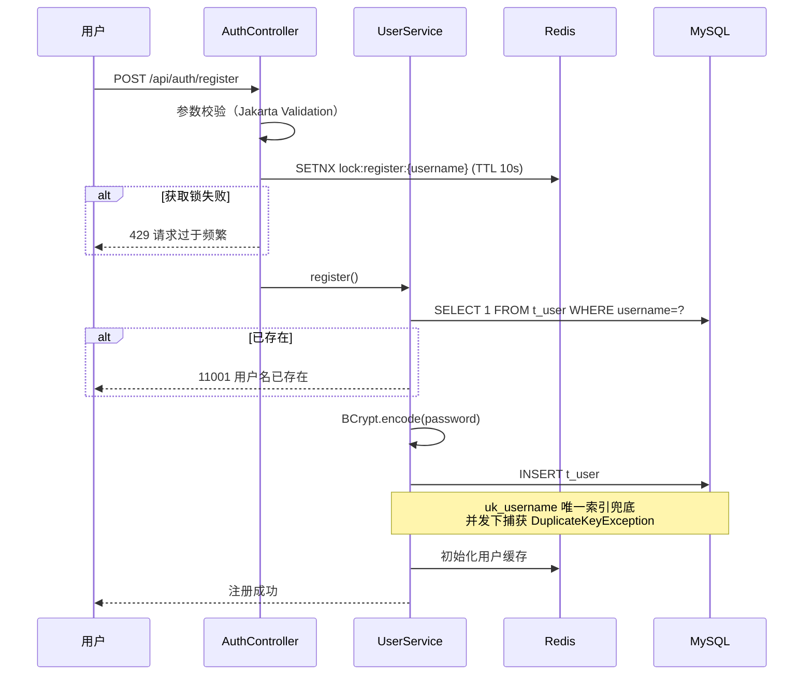
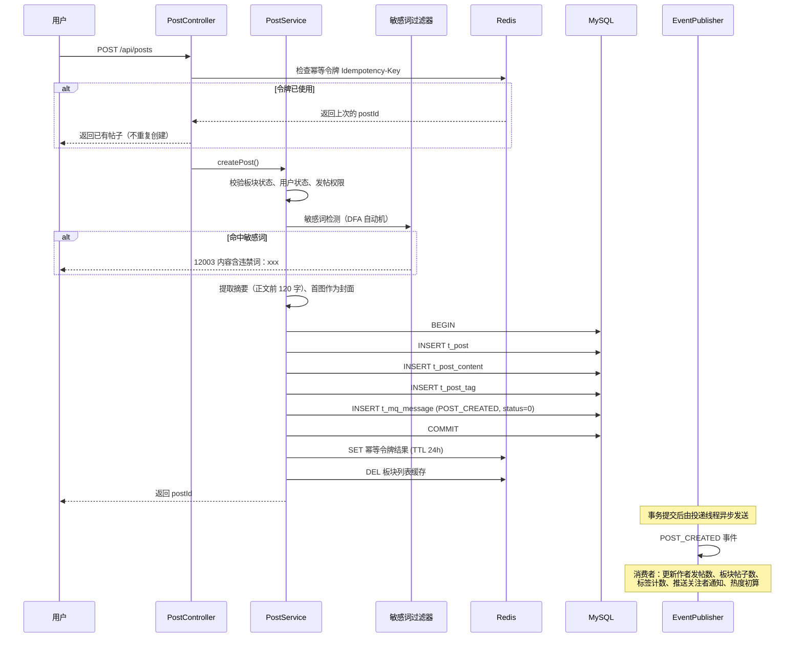
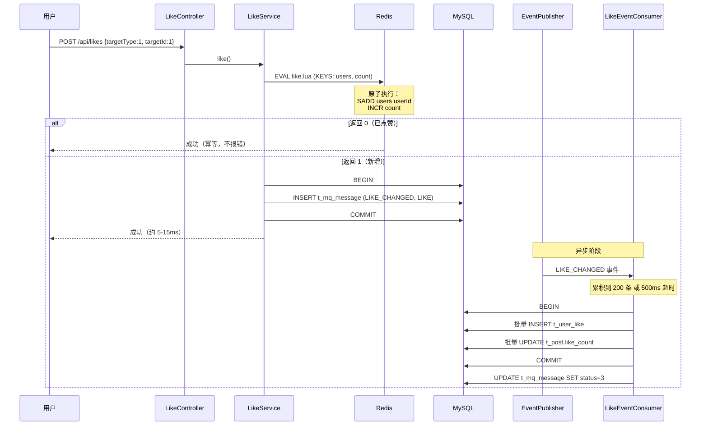
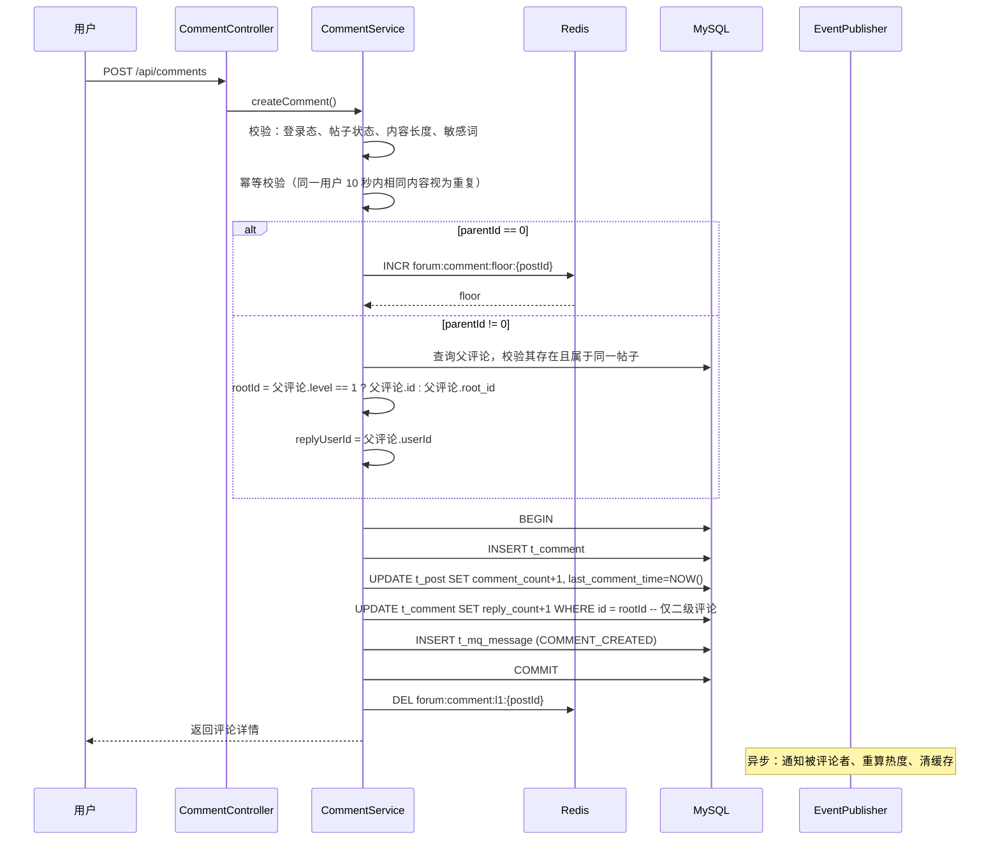
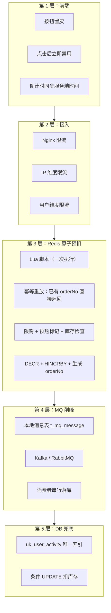
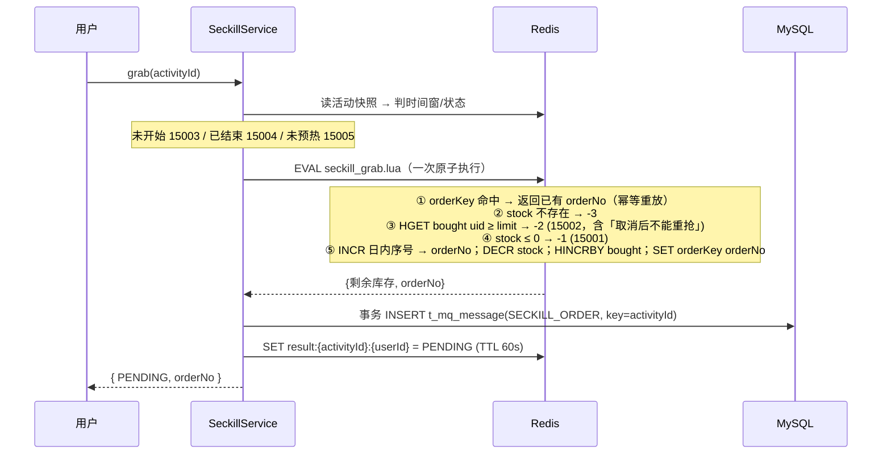
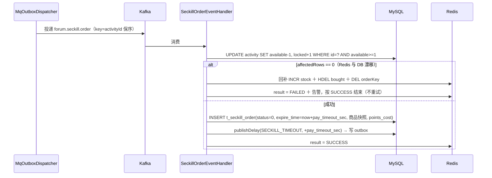
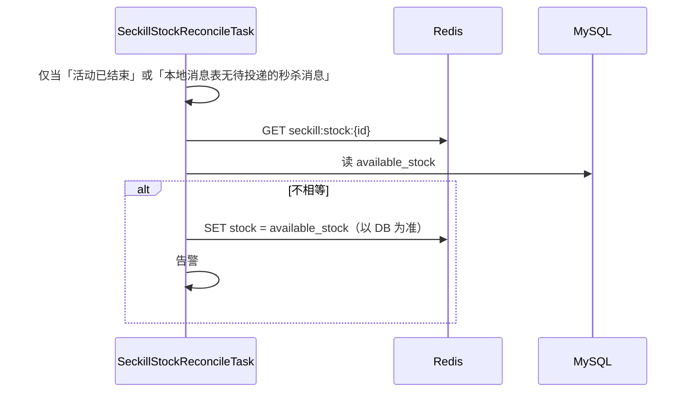

# 校园论坛系统 —— 功能设计说明书

| 项目 | 内容 |
|---|---|
| 文档版本 | V1.0 / 2026-09-14 |
| 接口前缀 | `/api`（前端）、`/api/admin`（后台） |
| 统一响应 | `Result<T> { code, message, data, traceId }` |

---

## 0. 通用约定

### 0.1 统一响应体

```json
{
  "code": 0,
  "message": "success",
  "data": { },
  "traceId": "a1b2c3d4e5f6"
}
```

### 0.2 错误码规范

| 区间 | 含义 | 示例 |
|---|---|---|
| 0 | 成功 | — |
| 10000–10999 | 通用错误 | 10001 参数校验失败、10002 未登录、10003 无权限 |
| 11000–11999 | 用户域 | 11001 用户名已存在、11002 密码错误、11003 账号被锁定 |
| 12000–12999 | 论坛域 | 12001 帖子不存在、12002 板块已关闭、12003 内容含敏感词 |
| 13000–13999 | 互动域 | 13001 重复点赞、13002 评论已删除 |
| 14000–14999 | 通知域 | — |
| 15000–15999 | 营销域 | 15001 库存不足、15002 重复下单、15003 活动未开始、15004 已达限购 |
| 16000–16999 | 积分与商城域 | 16001 今日已签到、16002 积分不足、16003 商品不存在、16004 商品已下架、16005 库存不足、16006 订单不存在、16007 订单状态异常 |
| 50000+ | 系统错误 | 50000 服务器内部错误、50001 服务降级中 |

### 0.3 分页约定

**游标分页（推荐用于信息流）**

```
GET /api/posts?boardId=2&sort=latest&cursor=<base64>&size=20
→ { "list": [...], "nextCursor": "<base64>", "hasMore": true }

cursor 解码后为 (排序键值, id) 二元组，如 "2026-09-01 09:30:00|100"
```

**实现**：**复合游标**，而不是单纯的 `id < cursor`。

```sql
SELECT id, title, like_count, publish_time
FROM t_post
WHERE board_id = ? AND status = 1 AND type = 0
  AND (publish_time, id) < (?, ?)      -- 行值比较：(排序键, id) 严格小于游标
ORDER BY publish_time DESC, id DESC
LIMIT ?;
```

**为什么游标必须带 `id` 而不能只用 `publish_time`？** 同一秒内可能有多条帖子（`publish_time` 精度到秒），只用时间做游标会漏掉或重复该秒内的其他帖子。`id` 作为决胜列保证全序，不重不漏。

**为什么不用 `LIMIT offset, size`？** 深分页时 MySQL 需要扫描并丢弃前 `offset` 行，第 1000 页（offset=20000）的查询代价是第 1 页的数十倍。复合游标配合正确的索引（见《04-数据库设计》1.5 节）可以做到任意页代价相同。代价是不支持「跳到第 N 页」——但信息流产品本来也不需要这个功能。

> ⚠️ **索引前提**：复合游标「任意页代价相同」的结论**只在索引末尾追加了 `id DESC` 时成立**。若缺少 `id DESC`，MySQL 会退化为 filesort——即先把满足条件的行全部取出再排序，深分页的性能问题原封不动地回来了。这一条已在 MySQL 8.4 上实测验证，详见《04-数据库设计》1.5 节。

**页码分页（用于后台列表）**：后台数据量可控且需要跳页，使用 `LIMIT offset, size` + `COUNT(*)`。

---

## 1. 用户模块

### 1.1 注册

**接口**

```
POST /api/auth/register
Body: { "username": "zhangsan", "password": "xxx", "nickname": "张三",
        "email": "z@school.edu", "studentNo": "2021001001",
        "college": "信息工程学院", "major": "软件工程" }
```

**校验规则**

| 字段 | 规则 |
|---|---|
| username | 4–20 位，字母开头，仅字母数字下划线，唯一 |
| password | 8–32 位，必须含字母和数字 |
| nickname | 2–20 字符，不含特殊符号 |
| studentNo | 8–20 位数字，唯一（可选） |
| email | 合法邮箱格式（可选） |

**流程**



**并发处理**：Redis 锁只是第一层过滤，**真正的保证是 `uk_username` 唯一索引**。捕获 `DuplicateKeyException` 后返回友好提示，这是分布式场景下唯一可靠的做法（Redis 锁可能因超时失效）。

### 1.2 登录

**接口**

```
POST /api/auth/login
Body: { "username": "zhangsan", "password": "xxx", "deviceId": "web-xxx" }

Response: {
  "accessToken": "eyJ...",   // 30 分钟
  "refreshToken": "eyJ...",  // 7 天
  "expiresIn": 1800,
  "userInfo": { "id": 2, "nickname": "张三", "avatar": "..." }
}
```

**Token 设计**

| Token | 有效期 | 存储 | 用途 |
|---|---|---|---|
| AccessToken | 30 分钟 | 前端内存（Pinia） | 每次请求携带 |
| RefreshToken | 7 天 | 前端 localStorage | 换取新 AccessToken |

**为什么前端把 AccessToken 存在内存而不是 localStorage？** localStorage 可被 XSS 脚本读取，而内存中的变量在页面刷新后即丢失——这正是我们希望的效果（丢失去换取刷新）。RefreshToken 必须持久化，但它只在刷新接口这一个路径上使用，且服务端可随时 `DEL` 使之失效。

**刷新机制**：Axios 响应拦截器检测到 401 时，自动用 RefreshToken 调用 `/api/auth/refresh` 换新 Token 并重放原请求。多个请求同时 401 时用 Promise 队列去重，只发起一次刷新。

### 1.3 登出与踢人

```
POST /api/auth/logout          当前设备登出
POST /api/admin/users/{id}/kick  管理员强制下线
```

**实现**：`DEL auth:token:{userId}:{deviceId}`。由于每次请求都会校验这个 Key 是否存在，删除后旧 Token 立即失效。

---

## 2. 帖子模块

### 2.1 发帖

```
POST /api/posts
Headers: { "Idempotency-Key": "uuid-xxx" }
Body: {
  "boardId": 2,
  "title": "考研数学复习规划",
  "content": "# 标题\n正文内容...",
  "tags": [1, 9],
  "images": ["https://cdn.../1.png"],
  "status": 1          // 0草稿 1发布
}
```

**处理流程**



**摘要生成规则**：去除 Markdown 标记 → 去除图片链接 → 取前 120 字符 → 截断处补「…」。**在写入时生成并存储**，而非查询时计算——列表页每页 20 条帖子，若每条都实时解析 Markdown，开销不可接受。

### 2.2 帖子列表

```
GET /api/posts?boardId=2&sort=latest&cursor=100&size=20&tagId=1
```

| 参数 | 取值 | 说明 |
|---|---|---|
| sort | `latest` / `hot` / `reply` / `essence` | 最新 / 最热 / 最新回复 / 精华 |

**各排序的实现路径**

| sort | Redis 结构 | 更新时机 | DB 兜底 |
|---|---|---|---|
| `latest` | ZSet `forum:post:list:{boardId}:latest`，score = publishTime | 发帖时 `ZADD` | `idx_board_list` |
| `hot` | ZSet `forum:post:list:{boardId}:hot`，score = hotScore | 每 5 分钟批量重算 | `idx_board_hot` |
| `reply` | ZSet `forum:post:list:{boardId}:reply`，score = lastCommentTime | 评论时 `ZADD` | `idx_last_comment` |
| `essence` | ZSet `forum:post:list:{boardId}:essence` | 加精/取消加精时 | `idx_board_list` + `type=2` |

**置顶帖与列表分离（重要）**

列表页的帖子分两部分查询后拼接，**而不是用一条 SQL 靠 `ORDER BY type DESC, publish_time DESC` 排出来**：

```
第一部分：置顶/公告帖（type != 0）
  → 结果集极小（每板块通常 < 10 条），整体缓存 1 小时，允许 filesort
  → 索引 idx_pinned (board_id, status, type)

第二部分：普通帖（type = 0）
  → 走复合游标分页，索引 idx_board_list，无 filesort
```

**为什么不合并成一条查询？** `type != 0` 是范围条件而非等值条件。一旦 `type` 作为排序列出现在前导位置，MySQL 就无法用同一个索引既完成范围扫描又保证有序输出，必然退化。实测证实合并查询会产生 `Using filesort`，分离后消失。完整分析见《04-数据库设计》4.2 节。

**列表查询流程**

```
1. ZREVRANGE forum:post:list:{boardId}:{sort} cursor+1 .. cursor+size  → 得到 postId 列表
2. 批量 MGET 帖子详情缓存：forum:post:detail:{postId}
3. 命中不足时批量查 MySQL（WHERE id IN (...)）并回填缓存
4. 批量填充作者信息（UserApi.batchGetUserBrief）
5. 批量查询当前用户是否已点赞（Redis SISMEMBER 管道）
6. 返回
```

**关键点**：第 5 步用 Redis **Pipeline 批量判重**，20 条帖子只需一次网络往返。若每条都单独查一次 Redis，20 次往返会让接口耗时增加 20–40ms。

### 2.3 帖子详情

```
GET /api/posts/{postId}
Response: {
  "id": 1, "boardId": 2, "boardName": "学习交流",
  "title": "...", "content": "...", "contentHtml": "...",
  "author": { "id": 2, "nickname": "张三", "avatar": "...", "level": 5 },
  "likeCount": 156, "commentCount": 42, "viewCount": 3241,
  "isLiked": true, "isCollected": false,
  "tags": [{"id":1,"name":"考研"}],
  "publishTime": "2026-09-01 09:30:00"
}
```

**浏览数处理**

不直接 `UPDATE t_post SET view_count = view_count + 1`——这会让每次详情页访问都产生一次写操作和行锁竞争。

方案：Redis `INCR forum:post:view:{postId}`，每 5 分钟由定时任务批量刷回 DB。

**同一用户 30 分钟内重复浏览只计数一次**：用 `SETNX forum:post:viewed:{postId}:{userId}` TTL 1800s 判定。

### 2.4 帖子搜索

```
GET /api/posts/search?keyword=考研数学&boardId=2&cursor=0&size=20
```

**实现**：MySQL 全文索引 + ngram 分词器。

```sql
SELECT id, title, summary, user_id, like_count, publish_time,
       MATCH(title, summary) AGAINST (#{keyword} IN BOOLEAN MODE) AS score
FROM t_post
WHERE status = 1
  AND MATCH(title, summary) AGAINST (#{keyword} IN BOOLEAN MODE)
ORDER BY score DESC, publish_time DESC
LIMIT #{size} OFFSET #{cursor};
```

**前置条件**：`ngram_token_size = 2`（默认值），支持中文按二字词切分。

**演进方向**：数据量超过 500 万后，全文索引的维护成本会显著上升，此时迁移到 Elasticsearch。当前不引入 ES 的理由是它需要独立集群与数据同步链路，对校园论坛量级是过度设计。

---

## 3. 点赞模块（核心）

### 3.1 数据结构设计

| Key | 类型 | 说明 |
|---|---|---|
| `forum:like:target:{type}:{id}:users` | Set | 点赞用户集合，`SADD` 返回 1/0 天然幂等判重 |
| `forum:like:target:{type}:{id}:count` | String | 点赞数实时值 |

**为什么用 Set 而不是 Bitmap？**

| 方案 | 内存（100 万次点赞） | 判重 | 适用条件 |
|---|---|---|---|
| Set（本方案） | 约 40–60 MB | `SADD` / `SISMEMBER` O(1) | 任意 userId |
| Bitmap | 约 125 KB（5 万用户） | `GETBIT` / `SETBIT` O(1) | userId 必须**连续且密集** |

Bitmap 内存优势巨大，但要求 userId 是连续自增且用户密度高。校园论坛用户量 5 万，Id 空间 1–50000 且无大量空洞——**Bitmap 实际上更优**。

**但本设计仍选 Set**，理由是：Bitmap 方案在「取点赞用户列表」（帖子详情页展示点赞头像）时需要遍历所有 bit 位还原 userId，复杂度 O(Id空间) 而非 O(点赞数)；而 Set 直接 `SRANDMEMBER` 取前 10 个即可。**帖子详情页展示点赞用户是高频需求，这个代价不能接受。**

若未来 Bitmap 的内存优势变得关键，可采用混合方案：Bitmap 存状态判重，Hash 存最近点赞用户。

### 3.2 点赞流程



### 3.3 取消点赞

```lua
-- unlike.lua
-- KEYS[1] = forum:like:target:{type}:{id}:users
-- KEYS[2] = forum:like:target:{type}:{id}:count
-- ARGV[1] = userId
local removed = redis.call('SREM', KEYS[1], ARGV[1])
if removed == 1 then
    local cnt = redis.call('DECR', KEYS[2])
    if cnt < 0 then
        redis.call('SET', KEYS[2], 0)   -- 防御性修正，避免出现负数
        return 0
    end
    return 1
end
return 0   -- 本来就没点赞，幂等返回
```

**为什么 `SREM` 和 `DECR` 要放在同一个 Lua 里？** 若分两次调用，正好在两次调用之间缓存过期，重建时从 DB 读到的计数可能已包含本次操作，导致重复计数。Lua 保证两步之间不会插入其他命令。

### 3.4 消费端批量聚合

**为什么批量？** 5000 QPS 的点赞若逐条落库，就是 5000 次 `INSERT` + 5000 次 `UPDATE`，MySQL 直接被打满。

```java
@Component
@RequiredArgsConstructor
public class LikeEventConsumer {

    private static final int BATCH_SIZE = 200;
    private static final long FLUSH_INTERVAL_MS = 500;

    private final List<LikeChangedEvent> buffer = new ArrayList<>();
    private final ReentrantLock lock = new ReentrantLock();

    @Override
    public ConsumeResult handle(LikeChangedEvent event) {
        lock.lock();
        try {
            buffer.add(event);
            if (buffer.size() >= BATCH_SIZE) {
                flush();
            }
        } finally {
            lock.unlock();
        }
        return ConsumeResult.SUCCESS;
    }

    /** 定时触发，保证低流量时数据也能及时落库 */
    @Scheduled(fixedDelay = FLUSH_INTERVAL_MS)
    public void scheduledFlush() {
        lock.lock();
        try {
            if (!buffer.isEmpty()) {
                flush();
            }
        } finally {
            lock.unlock();
        }
    }

    private void flush() {
        List<LikeChangedEvent> batch = new ArrayList<>(buffer);
        buffer.clear();
        // 按 action 分组，LIKE 走批量 INSERT IGNORE，UNLIKE 走批量 DELETE
        // 按 targetId 聚合计数变更，一次 UPDATE 更新多条
    }
}
```

**批量 INSERT 的写法**：

```sql
INSERT IGNORE INTO t_user_like (user_id, target_type, target_id, target_owner_id, create_time)
VALUES (?,?,?,?,?),(?,?,?,?,?),...;
```

**为什么是 `INSERT IGNORE` 而不是普通 `INSERT`？** 消费端可能重复消费，`INSERT IGNORE` 遇到唯一索引冲突时跳过而非抛异常，避免了大量异常的产生（异常在 JVM 中构造堆栈的成本很高，5000 QPS 下会显著影响性能）。

**计数更新聚合**：同一批中同一帖子的多次点赞合并为一次更新。

```sql
UPDATE t_post p
SET p.like_count = p.like_count + c.delta
FROM (SELECT target_id, COUNT(*) AS delta FROM ... GROUP BY target_id) c
WHERE p.id = c.target_id;
```

MySQL 8.0 不支持 `UPDATE ... FROM` 这种写法，实际使用：

```sql
UPDATE t_post p
  JOIN (SELECT ? AS target_id, ? AS delta UNION ALL SELECT ?, ?) c
    ON p.id = c.target_id
SET p.like_count = p.like_count + c.delta;
```

或用 `CASE WHEN` 批量更新：

```sql
UPDATE t_post
SET like_count = like_count + CASE id
    WHEN 1 THEN 3
    WHEN 5 THEN -1
    END
WHERE id IN (1, 5);
```

### 3.5 幂等与顺序性

| 问题 | 解决 |
|---|---|
| 消息重复投递 | `uk_user_target` + `INSERT IGNORE` |
| `LIKE` 与 `UNLIKE` 乱序 | 事件携带 `timestamp`；消费端比较 Redis 中 `like:ts:{bizKey}` 的值，只处理更新的消息 |
| Redis 计数与 DB 计数漂移 | 每日 03:00 全量对账，以 `t_user_like` 行数为准修正 `t_post.like_count` |
| Redis 宕机后计数丢失 | 冷启动时 `SELECT COUNT(*) FROM t_user_like WHERE target_id=?` 重建 |

---

## 4. 评论模块

### 4.1 数据结构：两级模型

```
帖子 #1
├── 一级评论 #1（floor=1，张三）
│   ├── 二级评论 #2（李四 回复 张三）  ┐
│   └── 二级评论 #3（王五 回复 张三）  ├─ root_id 都指向 #1
├── 一级评论 #4（floor=2，赵六）
│   └── 二级评论 #5（张三 回复 赵六）  ┘
└── 一级评论 #6（floor=3，王五）
```

**核心字段关系**

| 评论 | level | root_id | parent_id | reply_user_id | floor |
|---|---|---|---|---|---|
| #1 一级 | 1 | 0 | 0 | 0 | 1 |
| #2 二级 | 2 | 1 | 1 | 张三(id=2) | 0 |
| #3 二级 | 2 | 1 | 1 | 张三(id=2) | 0 |
| #4 一级 | 1 | 0 | 0 | 0 | 2 |
| #5 二级 | 2 | 4 | 4 | 赵六(id=5) | 0 |

**注意 #5**：虽然它显示上依附于 #4，但如果它是回复 #5 之下的某条评论，`parent_id` 会指向那条评论而 `root_id` 仍为 4。**查询永远只用 `root_id`，`parent_id` 只用于渲染「回复 @某某」。**

### 4.2 发表评论

```
POST /api/comments
Body: {
  "postId": 1,
  "content": "写得很好，收藏了",
  "parentId": 0,          // 0 = 一级评论；非 0 = 回复某条评论
  "images": []
}
```

**流程**



**评论的同步写库包含三个 UPDATE，是否会有锁竞争？**

会。热帖的评论会导致 `t_post` 同一行的行锁竞争。但由于：
1. 评论频率远低于点赞（单帖通常几十条 vs 数万点赞）
2. 事务内操作简单，持有锁时间 < 5ms

故不构成瓶颈。若未来成为瓶颈，可将 `comment_count` 更新改为异步（与点赞一致），但**评论内容本身必须同步写**。

### 4.3 评论列表

```
GET /api/posts/{postId}/comments?cursor=0&size=20
Response: {
  "list": [{
    "id": 1, "floor": 1, "content": "...",
    "user": { "id": 3, "nickname": "李四", "level": 3 },
    "isAuthor": false, "isLiked": true, "likeCount": 18,
    "replyCount": 2, "createTime": "...",
    "replies": [              // 默认返回前 2 条二级评论
      { "id": 2, "content": "...", "user": {...}, "replyUser": {"nickname":"李四"} }
    ]
  }],
  "nextCursor": "20", "hasMore": true, "total": 42
}
```

**查询策略**：先查一级评论分页，再批量查询这些一级评论下的前 2 条二级评论。

```sql
-- 1. 一级评论分页
SELECT * FROM t_comment
WHERE post_id = ? AND root_id = 0 AND status = 1
ORDER BY floor
LIMIT ? OFFSET ?;

-- 2. 批量查二级评论（用窗口函数取每组的 top 2）
SELECT * FROM (
  SELECT *, ROW_NUMBER() OVER (PARTITION BY root_id ORDER BY create_time) AS rn
  FROM t_comment
  WHERE root_id IN (?, ?, ...) AND status = 1
) t WHERE t.rn <= 2;
```

**避免 N+1 查询**：若对每条一级评论单独查一次二级评论，20 条一级评论就是 21 次查询。窗口函数一次查询解决。

### 4.4 删除评论

```
DELETE /api/comments/{id}
```

**软删除而非物理删除**：`status = 3`，前端渲染为「该评论已删除」。

**理由**：若物理删除，会出现「张三回复了李四，但李四的评论不见了」的断裂——后来者无法理解上下文。保留占位符可维持对话的完整性。段落中的 `reply_count` 也需相应递减。

**权限**：评论作者本人、帖子作者、版主、管理员可删除。

---

## 5. 通知模块

### 5.1 通知聚合

**问题**：一条热门帖子可能在 1 分钟内被点赞 500 次，若产生 500 条通知，用户的通知列表会被彻底淹没。

**方案：Redis 窗口聚合**

```
Key: forum:notif:agg:{receiverId}:{type}:{bizId}
类型: Hash
字段: { senderIds: [1,2,3...], firstTime, lastTime, count }
TTL:  5 分钟
```

消费者收到 `LIKE_CHANGED` 时：

```lua
-- 追加发送者到聚合桶，返回当前聚合人数
local key = 'forum:notif:agg:' .. ARGV[1] .. ':1:' .. ARGV[2]
local added = redis.call('HSETNX', key, ARGV[3], '1')  -- senderId 去重
redis.call('EXPIRE', key, 300)
return redis.call('HLEN', key)
```

窗口结束后（由定时任务扫描，或在下一条通知落库时顺带检查），生成一条通知：

```json
{
  "type": 1,
  "title": "收到新的点赞",
  "content": "张三等 5 人赞了你的帖子「考研数学复习规划」",
  "extra": { "senderIds": [2,3,4,5,6], "count": 5 },
  "bizType": 1, "bizId": 1
}
```

**「等」字的处理**：1 人时不加「等」——「张三赞了你的帖子」；多人时——「张三等 5 人赞了你的帖子」。

### 5.2 未读数

```
GET  /api/notifications/unread-count  → { "total": 12, "like": 5, "comment": 6, "follow": 1 }
POST /api/notifications/read  { "ids": [1,2,3] }
POST /api/notifications/read-all
```

**未读数用 Redis 计数器**（`forum:notif:unread:{userId}`）而非 `COUNT(*)`。`COUNT(*)` 在通知表 3000 万行时即使有索引也要扫描不少数据，而首页每次加载都要查一次未读数。

**一致性**：Redis 计数与 DB 可能漂移，故每次查询未读数时若 Redis 无值则从 DB 重建（`SELECT COUNT(*) WHERE receiver_id=? AND is_read=0`），并设置 24 小时 TTL 作为兜底。

### 5.3 实时推送

本期采用**前端轮询**（每 30 秒查一次未读数），不引入 WebSocket。

**理由**：WebSocket 需要维护长连接、处理断线重连、在集群下需要网关做连接路由。对校园论坛而言，30 秒的通知延迟用户完全无感，而 WebSocket 的复杂度是实打实的。**这是典型的"不做"决策。**

演进：若需实时性，可引入 SSE（Server-Sent Events）——比 WebSocket 简单得多，且天然支持断线重连。

---

## 6. 积分秒杀模块（核心）

积分商城页面上的「限时抢购」区块。它与普通的积分兑换**并列但完全分开**：

| 维度 | 普通积分兑换（§9.4） | 积分秒杀（本节） |
|---|---|---|
| 流量 | 日常个位数 QPS | 瞬时万级 QPS 洪峰 |
| 库存层 | DB 条件 UPDATE | **Redis 预扣** + DB 条件 UPDATE |
| 中间态 | 无（兑换即时完成） | 有（待支付，`locked_stock`） |
| 落库 | 同步 | **异步**（Kafka） |
| 积分 | 同步扣 | 同步扣（**同样在 DB 扣**） |

判据只有一条：**有没有流量洪峰**。给低频场景套上「预扣 + 异步落库 + 对账」只会得到一个更容易出错、且没有任何性能收益的实现（ADR-008）——反过来，让万级 QPS 直接打 MySQL 则会把数据库拖垮（ADR-004）。

> **一句话记住本节的边界**：**库存可以预扣，积分不可以。**
> 库存扣多了有回补路径，属于「可自愈」的临时状态；积分是用户资产，预扣意味着 Redis 与账户余额出现第二份真相——这正是 ADR-008 要避免的。因此 Redis 只预扣库存，积分一律在支付时用 `WHERE balance >= ?` 扣。

### 6.1 秒杀整体架构



### 6.2 活动创建与预热

- **创建**：管理端传 `goodsId`，服务端经 `MallAdminApi` 校验商品存在，并把 `name/cover/type` **快照**进 `t_seckill_activity`。快照的理由与订单冗余 `goods_name` 一致：抢购是热路径，不应该为了展示一次商品名而跨模块查库；商品改名也不应改写历史活动。

```java
@Scheduled(cron = "0 * * * * ?")   // 每分钟扫描
public void warmupActivities() {
    List<SeckillActivity> activities = activityMapper.selectWarmupList(
        LocalDateTime.now().plusMinutes(warmupMinutes));   // 即将开始的

    for (SeckillActivity activity : activities) {
        RLock lock = redissonClient.getLock(RedisKey.seckillWarmupLock(activity.getId()));
        if (!lock.tryLock()) continue;

        try {
            String stockKey = RedisKey.seckillStock(activity.getId());
            // SETNX 保证重复预热不会覆盖已扣减的库存
            Boolean ok = redisTemplate.opsForValue().setIfAbsent(
                stockKey, String.valueOf(activity.getAvailableStock()), 24, TimeUnit.HOURS);

            if (Boolean.TRUE.equals(ok)) {
                redisTemplate.opsForHash().putAll(
                    RedisKey.seckillActivityInfo(activity.getId()), toMap(activity));
                redisTemplate.opsForValue().set(
                    RedisKey.seckillWarmup(activity.getId()), "1");
                log.info("秒杀活动预热成功 activityId={} stock={}",
                    activity.getId(), activity.getAvailableStock());
            }
        } finally {
            lock.unlock();
        }
    }
}
```

**关键点：用 `SETNX` 而非 `SET`**。若用 `SET`，定时任务每分钟执行一次会不断把库存重置回初始值——**这会导致超卖**。`SETNX` 保证只有第一次预热生效。

**预热失败的处理**：预热失败时，活动对用户展示「即将开始」，抢购请求返回 15005（活动太火爆），而不是 15001（已抢光）。后者是错误的信息——用户没抢到不是因为被抢完了，而是因为系统还没准备好。

### 6.3 抢购：`POST /api/seckill/{activityId}/grab`



**Lua 脚本 `seckill_grab.lua`**

```lua
-- KEYS[1] = forum:seckill:stock:{activityId}            剩余库存
-- KEYS[2] = forum:seckill:bought:{activityId}           已抢用户 Hash（userId → 数量）
-- KEYS[3] = forum:seckill:order:{activityId}:{userId}   该用户的 orderNo
-- KEYS[4] = forum:seckill:order:no:{yyyyMMdd}           日内序号
-- ARGV[1] = userId
-- ARGV[2] = perUserLimit
-- ARGV[3] = 订单号前缀，如 "S20260917"
--
-- 返回值：
--   {>=0 剩余库存, orderNo}  预扣成功
--   {-1}  库存不足（未抢到）
--   {-2}  已达限购（含取消后不可重抢）
--   {-3}  活动未预热

-- 1. 幂等重放：已经抢到过就直接返回同一张单，不再扣库存
local existed = redis.call('GET', KEYS[3])
if existed then
    return {tonumber(redis.call('GET', KEYS[1]) or '0'), existed}
end

-- 2. 预热检查：库存 Key 不存在说明活动尚未预热
local stock = redis.call('GET', KEYS[1])
if stock == false then
    return {-3}
end

-- 3. 限购检查
local bought = tonumber(redis.call('HGET', KEYS[2], ARGV[1]) or '0')
if bought >= tonumber(ARGV[2]) then
    return {-2}
end

-- 4. 库存检查
if tonumber(stock) <= 0 then
    return {-1}
end

-- 5. 生成订单号并原子扣减
local seq = redis.call('INCR', KEYS[4])
if seq == 1 then
    redis.call('EXPIRE', KEYS[4], 172800)   -- 2 天，覆盖跨天即可
end
local orderNo = ARGV[3] .. string.format('%06d', seq)

redis.call('DECR', KEYS[1])
redis.call('HINCRBY', KEYS[2], ARGV[1], 1)
redis.call('SET', KEYS[3], orderNo)

return {tonumber(stock) - 1, orderNo}
```

**三个刻意的设计选择**

| 选择 | 理由 |
|---|---|
| orderNo 在 Lua 内 `INCR` 生成 | 失败路径不消耗序号；「生成 + 预扣 + 记录」严格原子，不会出现「扣了库存却没拿到单号」 |
| 已抢用户用 **Hash** 而非 Set | `per_user_limit` 成为可配置参数（`HGET` 判 0/1，`HINCRBY` 累加），未来放开限购无需改脚本与数据结构 |
| 返回值用负数而非抛异常 | Lua 抛异常有额外性能开销且错误信息难以区分；约定返回值更清晰 |

**为什么第一步是幂等重放而不是限购检查？** 用户连点或网络重试时，他要的是「我那一单」，而不是「你已达限购」。把已有 `orderNo` 原样返回，前端拿到的是同一个订单号，天然幂等。

**前端轮询结果**

```
GET /api/seckill/{activityId}/result
→ { "status": "SUCCESS", "orderNo": "S20260917000001", "order": {...} }
→ { "status": "PENDING" }                          // 继续轮询
→ { "status": "FAILED",  "reason": "库存不足" }
→ { "status": "TIMEOUT" } / { "status": "CANCELLED" }
```

轮询间隔：首次 200ms，之后 500ms 递增至 2s，最多 10 次。

**已知窗口（可自愈，方向安全）**：Redis 预扣成功、但写 `t_mq_message` 前进程崩溃 → 库存泄漏，**不会超卖**。这与签到位图「宁可多算、由修复任务兜底」是同一条取舍：宁可少卖，不可超卖，且不一致方向必须可自愈（§6.8 对账）。

### 6.4 异步落库（outbox → Kafka → 消费者）



- **消息自带 payload**（`userId/activityId/orderNo`）。Redis 只承担「结果查询」与「幂等重放」，**不作为「用户是否已取消」的判断依据**——消费者「先读 Redis、再写库」与用户取消之间存在必然竞态（读到了、写库前用户取消了，用户看到「已取消」却有订单）。消息自包含，这个窗口就不存在。
- **`DuplicateKeyException` 必须在 handler 内捕获**并按「已下单」返回 `SUCCESS`。`MessageDispatcher` 会把未捕获的异常判为系统异常并重试 5 次，而这条消息重试多少次结果都一样，只会白占消费线程。
- **保序**：`routingKey = activityId`，同一活动的消息进同一分区。顺序不是正确性的依赖（DB 条件 UPDATE 与唯一索引才是），但能让结果更符合直觉、排查更容易。
- Kafka 无原生延迟消息，`publishDelay` 写 `t_mq_message.next_retry_time`，由 `MqOutboxDispatcher` 到期投递（见 `KafkaEventPublisher.publishDelay`）。

### 6.5 支付与订单完成：`POST /api/seckill/orders/{orderNo}/pay`

```java
@Transactional(rollbackFor = Exception.class)
public void pay(Long userId, String orderNo) {
    // 1. 状态机当闸门：只有待支付能支付。用条件 UPDATE，不用「先查再改」
    if (orderMapper.markPaid(orderNo, userId) == 0) {
        throw new BizException(ErrorCode.SECKILL_ORDER_STATUS_ILLEGAL);   // 15008
    }

    // 2. 扣积分。不足则抛 16002，整个事务回滚 —— 订单回到待支付，等超时释放
    pointsSpendApi.spendForSeckill(userId, order.getPointsCost(), orderNo, order.getGoodsName());

    // 3. 库存三层模型：locked → sold
    if (activityMapper.markSold(order.getActivityId()) == 0) {
        throw new BizException(ErrorCode.SYSTEM_ERROR);   // 数据不一致，回滚
    }

    // 4. 结果缓存置为已支付（前端「我的秒杀」不再显示支付倒计时）
    redis.opsForValue().set(RedisKey.seckillResult(order.getActivityId(), userId), "SUCCESS");
}
```

**为什么支付不需要 `FOR UPDATE`**：三步操作各有条件 UPDATE 把关，`status=0` 这一条就足以拦住重复支付与并发支付（第二次影响 0 行）。悲观锁留给真正需要「一连串读改写」的场景，这里的每一步都是单条语句。

**为什么积分在支付时才扣，而不是抢购时**：抢购时扣积分意味着「Redis 里也要记一份已扣积分」，且抢到不支付的人会占着积分。把积分留到支付，超时未支付则**积分从未被扣过**，取消路径只需回补库存，不需要退积分——少一条退款链路，就少一类不一致。

**Redis 库存全程不动**：`available → locked`（下单）与 `locked → sold`（支付）都不改变「还能被抢的数量」，所以 `Redis 剩余 == available_stock` 始终成立（§6.8）。

### 6.6 订单超时取消

三条入口，互为备份：

1. **延迟消息（主路径）**：下单时 `publishDelay(SECKILL_TIMEOUT, pay_timeout_sec)`。
   - RabbitMQ：TTL 队列 + 死信交换机，原生支持。
   - Kafka：**无原生延迟**。`publishDelay` 写 `t_mq_message`（`next_retry_time = now + delay`），由 `MqOutboxDispatcher` 到期投递。
2. **定时扫描（兜底）**：每 5 分钟扫 `status=0 AND expire_time < NOW() LIMIT 500`。
3. **用户主动取消**：`POST /api/seckill/orders/{orderNo}/cancel`（仅本人、仅待支付）。

```java
@Transactional(rollbackFor = Exception.class)
public void cancelOrder(String orderNo, CancelReason reason) {
    SeckillOrder order = orderMapper.selectByOrderNo(orderNo);
    if (order == null) return;

    // 1. DB：状态机当闸门。影响 0 行说明已支付/已取消 —— 幂等返回，绝不重复回补
    if (orderMapper.markClosed(orderNo, reason.status()) == 0) {
        return;
    }

    // 2. DB：locked → available
    activityMapper.rollbackLockedStock(order.getActivityId(), order.getQuantity());

    // 3. Redis：回补库存（仅当库存 Key 还在，即活动未结束/已预热）
    if (Boolean.TRUE.equals(redis.hasKey(RedisKey.seckillStock(order.getActivityId())))) {
        redis.opsForValue().increment(RedisKey.seckillStock(order.getActivityId()), order.getQuantity());
    }

    // 4. 删除「分配键」（activity + user → orderNo）。
    //    留着它，用户再点抢购会命中 Lua 的幂等重放，拿回同一张**已取消**的订单，
    //    界面上看起来像「点了没反应」；删掉它，再抢会落到限购判定，得到明确的 15002
    redis.delete(RedisKey.seckillOrderNo(order.getActivityId(), order.getUserId()));

    // 5. ⚠️ 不删除 seckill:bought 中的用户标记 —— 见下方说明

    // 6. 结果缓存
    redis.opsForValue().set(RedisKey.seckillResult(order.getActivityId(), order.getUserId()),
            reason.status() == TIMEOUT ? "TIMEOUT" : "CANCELLED");
}
```

**⚠️ 三点最容易被写错**

- **必须回补 Redis 库存**。Lua 已经 `DECR` 过，不回补则每取消一单就永久泄漏一件——这正是「取消未回补 Redis」被列为本模块已知风险的原因。
- **回补的幂等靠第 1 步**：`markClosed` 影响 0 行就直接返回。若先回补再改状态，两个并发取消会各自回补一次，凭空多出库存。
- **不删除用户标记**。本产品「每人限购 1 件」是**活动期内的一次性资格**：取消只退还库存，不退还资格。因此取消后该用户再抢仍返回 15002。`t_seckill_order` 的 `uk_user_activity` 唯一索引是这条约束的最终保证——取消的订单行仍在，第二次抢购在 DB 层也插不进去。
- **两个 key 一删一留，缺一不可**。删掉「分配键」是为了让再次抢购落到限购判定（得到 15002），而不是命中 Lua 的幂等重放拿回那张已取消的单；保留 `bought` 计数是为了让限购真的生效。只删分配键不保留计数，用户就能反复「取消—重抢」，而 DB 的唯一索引会把第二单挡在门外，表现为「抢到了却没有订单」；只保留计数不删分配键，用户点抢购则完全没有反馈。

### 6.7 订单状态机

```
0 待支付 ──支付成功──→ 1 已支付(待发放) ──管理员发放──→ 5 已完成
   │
   ├── 用户取消 ──────→ 2 已取消（积分未扣过，库存已回补）
   └── 15 分钟超时 ───→ 3 超时关闭（同一套回补逻辑）
```

状态流转一律用**条件 UPDATE**（`WHERE id=? AND status=0`），影响行数为 0 即状态已变，返回 15008。这样「支付」与「取消」并发时只有一个能成功，不需要读一次再写一次。

### 6.8 库存对账



**对账口径：`Redis 剩余 == available_stock`。**

> **修正记录**：本节原先写作 `Redis 库存 == available_stock + locked_stock`。该口径与同节消费者的行为（下单即 `available-1, locked+1`）自相矛盾——两者相差一个 `locked`，照此实现会**每一次都误报库存不一致**。
> 正确理解：`locked_stock` 里的库存**早已被 Redis 扣减过**，它不属于「Redis 侧仍可抢的量」，因此不应计入对账口径。

**为什么必须限制执行时机**：洪峰期间 DB 的 `available_stock` 落后于 Redis（消费尚未落库），此时用 DB 覆盖 Redis 会把库存**调高**——直接导致超卖。因此只在「本地消息表无待投递的秒杀消息」或「活动已结束」时对账。

**修正方向**：一律以 DB 为准覆盖 Redis。库存泄漏（Redis 偏低）与库存虚高（Redis 偏高）都以 DB 收敛——宁可少卖，不可超卖。

### 6.9 全局不变量

| 阶段 | Redis stock | DB available | DB locked | DB sold | 订单 status |
|---|---|---|---|---|---|
| 预热后 | N | N | 0 | 0 | — |
| 抢到 | N-1 | N-1 | 1 | 0 | 0 待支付 |
| 支付成功 | N-1 | N-1 | 0 | 1 | 1 已支付 |
| 超时 / 取消 | N | N | 0 | 0 | 3 / 2 |

- `Redis stock == DB available_stock`（任何时刻）
- `total_stock == available_stock + locked_stock + sold_count`（任何时刻，活动结束时后两项归零）

### 6.10 秒杀接口的限流配置

| 维度 | 限制 | 实现 |
|---|---|---|
| 用户 | 每场活动 1 次（由 Lua 保证） | Lua `HINCRBY` |
| 用户 | 10 秒内最多 5 次请求 | Redisson `RRateLimiter` |
| IP | 每分钟 100 次 | Redis 计数 |
| 全局 | 单实例 5000 QPS | Sentinel / 本地令牌桶 |

---

## 7. 消息中间件切换的运维接口

为支撑 Kafka / RabbitMQ 的对比实验，提供以下运维接口：

```
GET  /api/admin/mq/status
→ {
    "provider": "kafka",
    "producer": { "sent": 1250342, "failed": 12, "avgCostMs": 1.8 },
    "consumer": { "consumed": 1250330, "failed": 0, "avgCostMs": 8.4 },
    "backlog": 12,
    "topics": [
      { "topic": "forum.like.changed", "backlog": 8, "tps": 4820 }
    ]
  }

POST /api/admin/mq/benchmark/start
Body: { "scenario": "LIKE_EVENT", "totalMessages": 1000000,
        "concurrency": 32, "batchSize": 100 }
→ 启动压测，结果写入 t_mq_benchmark_result

GET  /api/admin/mq/benchmark/compare?batchNo=B20260914-01
→ 返回两种 provider 的对比表格
```

**切换流程**：

1. 停止压测流量，确认两个 MQ 的消息都已消费完毕（`backlog = 0`）
2. 修改配置 `forum.mq.provider: rabbitmq`
3. 滚动重启（3 个实例逐个重启，保证服务不中断）
4. 校验 `/api/admin/mq/status` 确认切换成功
5. 重跑同一套压测脚本，记录结果

**注意**：切换过程中的**存量消息**不会被迁移。切换前必须确保旧 MQ 中的消息已全部消费完毕，否则这些消息将永远留在旧 MQ 中。这是一个运维约束，需要在切换手册中显著标注。

---

## 8. 后台管理功能

| 功能 | 接口 | 说明 |
|---|---|---|
| 用户列表 | `GET /api/admin/users` | 支持昵称/学号/状态筛选，页码分页 |
| 封禁用户 | `POST /api/admin/users/{id}/ban` | 同时 `DEL` 该用户的 Token 使其立即下线 |
| 帖子审核列表 | `GET /api/admin/posts?status=2` | 待审核帖子 |
| 审核通过 | `POST /api/admin/posts/{id}/approve` | `status: 2 → 1`，写 `publish_time` |
| 审核驳回 | `POST /api/admin/posts/{id}/reject` | `status: 2 → 3`，必填 `audit_remark` |
| 置顶/加精 | `POST /api/admin/posts/{id}/top`、`/essence` | 同时更新 Redis ZSet |
| 板块管理 | `CRUD /api/admin/boards` | 新增/修改/隐藏板块 |
| 券模板管理 | `CRUD /api/admin/coupons` | 上架前必须配置完整 |
| 活动管理 | `CRUD /api/admin/seckill-activities` | 创建后自动加入预热扫描队列 |
| 手动调整库存 | `POST /api/admin/seckill-activities/{id}/stock` | 使用乐观锁 `version`，需填调整理由 |
| 手动预热 | `POST /api/admin/seckill-activities/{id}/warmup` | 预热任务失败时的应急入口 |
| 库存对账查询 | `GET /api/admin/seckill-activities/{id}/reconcile` | 查看 Redis 与 DB 的库存差异 |
| 商城商品管理 | `CRUD /api/admin/mall/goods` | 新增/修改/上下架，**仅管理员**（见 9.5） |
| 兑换订单管理 | `GET /api/admin/mall/orders`、`POST /api/admin/mall/orders/{id}/finish` | 查看全部订单、标记已发放 |
| 手动结算签到奖励 | `POST /api/admin/points/settle-signin-bonus?month=YYYY-MM` | 定时任务漏跑时的补偿入口，幂等 |

**关键：封禁用户必须同时清理登录态。** 只改 `t_user.status` 是不够的——用户的 AccessToken 在 30 分钟内仍然有效。必须 `DEL auth:token:{userId}:*`。

---

## 9. 积分与商城模块（核心）

积分是站内的「软通货」，只有两个入口（每日签到、月度全勤奖励）和两个出口（商城兑换、取消订单退回）。
本节的设计目标只有一个：**积分不能凭空产生，也不能凭空消失**——每一分的变动都必须有一条流水与之对应。

### 9.1 数据模型

```
t_user_points   积分账户（1 用户 1 行）：balance / total_earned / total_spent
t_points_record 积分流水（只增不改）：change_amount（有符号）/ balance_after / biz_type / biz_id
t_user_signin   签到记录：user_id + signin_date（唯一）+ year_month（冗余，供月度结算）
t_mall_goods    商城商品：points_price / stock / sold_count / status
t_mall_order    兑换订单：order_no / points_cost / status
```

**恒等式**：`balance = total_earned - total_spent`，且 `balance = SUM(t_points_record.change_amount)`。
两个恒等式分别由「账户表冗余累计值」和「流水表」保证，定时对账可校验（见 9.6）。

**为什么积分账户不直接加一列到 `t_user`：**
1. `t_user` 是热点表（每次登录都要更新 `last_login_time`），把频繁变动的积分列塞进去只会加剧行锁竞争；
2. 更要命的是**事务会被拆成两半**：扣积分在 forum-points、写订单也在 forum-points，而积分余额却在 forum-user 的表里，只能走 `UserApi` 跨模块调用——同一个事务里跨模块写表，既违反模块边界，也让回滚语义变得难以推理。

**为什么每笔变动都要写流水：** 积分是可兑换实物的资产，出了争议必须能回答「这 100 分是哪来的」。
`t_points_record` 上的 `uk_user_biz (user_id, biz_type, biz_id)` 是**幂等兜底**：同一笔业务（同一天的签到、同月的奖励、同一张订单的退回）只可能记一次账。
Redis 去重、条件 UPDATE、消息重投都可能重复触发，唯一索引是最后一道防线——这一点与点赞的 `uk_user_target` 是同一个思路。

### 9.2 每日签到：Redis Bitmap

**Key**：`forum:points:signin:{userId}:{yyyyMM}`（Bitmap，bit 偏移 = 日 - 1，即 1 号在第 0 位）。
**TTL**：70 天（覆盖当月与次月的「上月回顾」展示）。两条刷新路径都刻意做成**有界**的：
签到路径只在 `SETBIT` 返回 0（即本次真的置了新位）时 `EXPIRE`，同一天的重复请求不刷新——
否则任何人反复调签到接口就能让 key 永不过期，等于没有 TTL；
位图重建任务每轮重设一次，因为 `SETBIT` 在已过期的 key 上会**新建一个永不过期的键**，
不补 TTL 就会把这份临时结构变成永久 key，而它只覆盖最近两个月，续命同样有界。

```lua
-- signin.lua：置位 + 回读，一次往返拿到「是否首次」与「本月天数」
local key    = KEYS[1]
local offset = tonumber(ARGV[1])   -- 日 - 1
local ttl    = tonumber(ARGV[2])
local prev   = redis.call('SETBIT', key, offset, 1)   -- 返回旧值：0 首次，1 已签
if prev == 0 then
    redis.call('EXPIRE', key, ttl)
end
return { prev, redis.call('BITCOUNT', key) }
```

**为什么用 Bitmap 而不是 Set 或数据库计数：**

| 方案 | 30 天所需空间（单用户） | 判定「今天签过没」 | 统计「本月签了几天」 |
|---|---|---|---|
| Set（存日期字符串） | ~30 × ~40 B ≈ 1.2 KB | `SISMEMBER` O(1) | `SCARD` O(1)，但存的是字符串 |
| **Bitmap** | **4 B**（31 位） | **`SETBIT` 的返回值本身就是判定** | **`BITCOUNT` O(1)，纯位运算** |
| MySQL `COUNT(*)` | — | 一次索引查询 | 一次索引查询，且并发下只是「统计」不是「判定」 |

- Bitmap 的内存是 Set 的约 1/300，且**签到场景恰好是 Bitmap 的最佳适用面**：ID 空间是「每月 31 天」这种小而连续的值域，不像点赞那样需要还原出「是谁」。
- `SETBIT` 返回旧值是这里的关键：**「判定 + 写入」合并成一次原子操作**，不需要 `GETBIT` + `SETBIT` 两步（两步之间的竞态会让用户拿到两份签到积分），也不需要额外的分布式锁。
- `BITCOUNT` 让「本月已签几天」变成一次 O(1) 位运算，前端要渲染的签到日历就是它的可视化。取整个位图用 `BITFIELD key GET u31 0` 一次读回，在应用层解出日期列表，避免 31 次 `GETBIT`。

**为什么 MySQL 仍然是最终真相：** Bitmap 只回答「这个月签了哪几天」，它不含积分、不含时间、无法审计，且随时可能因为 Redis 重启/淘汰而整体丢失。
因此**签到同时写 `t_user_signin`**（`uk_user_date` 唯一），Bitmap 是它的派生缓存。两者的关系与「点赞数 Redis 为实时真相」相反——这里 **Bitmap 只是判定与统计的加速器，真相在 MySQL**。

**完整流程**（`POST /api/points/signin`）：

```
1. EVAL signin.lua → {prev, days}
2. prev == 1  → 今日已签到，直接返回当前状态（幂等，不报错、不加分）
3. prev == 0  → 本地事务：
     a. INSERT t_user_signin (user_id, signin_date, year_month, points=5)
     b. INSERT t_points_record (biz_type=1, biz_id='yyyy-MM-dd', change=+5)
     c. UPDATE t_user_points SET balance=balance+5, total_earned=total_earned+5
4. 返回：本次获得积分 / 本月已签天数 / 距全勤奖励还差几天 / 最新余额
```

**失败与并发处理**（这一段是本模块最容易写错的地方）：

| 情况 | 处理 | 理由 |
|---|---|---|
| 并发双请求 | 只有一个请求能拿到 `prev=0` | `SETBIT` 是原子的，第二个请求直接走「已签到」分支 |
| 第 3 步抛 `DuplicateKeyException` | 按「已签到」返回，**不释放位** | 说明另一个请求已经签成功，位图是对的 |
| 第 3 步抛其他异常 | **释放位（`SETBIT key offset 0`）后向上抛** | 位图已置位而库里没有记录的话，用户今天既拿不到积分又不能再签——必须把位图退回去 |
| Redis 数据丢失 | 由对账任务以 MySQL 为准重建位图 | Bitmap 是派生态，任何时候都可以从 `t_user_signin` 重新算出来 |

> 「释放位」这一步写在事务之外的回滚分支里，因此不违反第 6 节「禁止在事务中做 Redis 写操作」的约定。

**为什么不像点赞那样用 MQ 异步落库：** 签到是**低频**（每人每天最多一次）、**强一致**（用户点完就要看到积分到账）、**不可重复**（重复即多发积分）的动作。异步化只会引入「积分什么时候到账」的不确定性，换不来任何吞吐收益——这与「评论同步落库」是同一类判断。

### 9.3 月度全勤奖励

**规则**：自然月内签到天数 **超过 25 天**（即 ≥ 26 天）时，额外赠送 100 积分。
阈值与奖励值都做成配置项（`forum.points.bonus-threshold` / `forum.points.bonus-points`），不写死在代码里。

**结算时机**：定时任务每天 00:10 结算**上一个月**，而不是每月 1 号才跑一次。
调度表达式同样做成配置项（`forum.points.bonus-cron`，默认 `0 10 0 * * ?`），
位图重建任务对应 `forum.points.repair-cron`（默认 `0 0 4 * * ?`）——
时间窗可挪动，才不会出现「为了避开备份窗口而改代码」这种事。

- 为什么不只在 1 号跑：应用在 1 号停机/重启就会整整漏掉一个月的奖励，且没有任何人会发现。每天跑一次意味着「错过一天，第二天自动补上」。
- 每天重跑不会重复发奖：`t_points_record` 的 `uk_user_biz(user_id, 2, 'yyyy-MM')` 让第二次插入直接冲突。

```sql
-- 结算查询：找出上月签到超过阈值、且尚未记过奖励账的用户
SELECT s.user_id
FROM t_user_signin s
WHERE s.year_month = #{yearMonth}
  AND NOT EXISTS (SELECT 1 FROM t_points_record r
                  WHERE r.user_id = s.user_id AND r.biz_type = 2 AND r.biz_id = #{yearMonth})
GROUP BY s.user_id
HAVING COUNT(*) > #{threshold}
```

> `year_month` 是冗余列而不是 `DATE_FORMAT(signin_date, '%Y-%m')`：后者会让索引失效，
> 结算查询就会变成一次全表扫描——而它偏偏是每天都要跑的。

**发放**：单事务内批量插流水（`biz_type=2, biz_id='yyyy-MM'`）+ 逐用户更新账户余额；
单轮上限 `2000` 人，超出部分留给下一轮（次日）继续，避免一次任务跑太久。

**手动补偿**：`POST /api/admin/points/settle-signin-bonus?month=YYYY-MM`（仅管理员），
幂等，可安全重放——这是给「定时任务连续多天失败」准备的应急入口，也是验收测试的入口。

### 9.4 积分商城

#### 商品模型

| 字段 | 说明 |
|---|---|
| `type` | 1 优惠券 2 实物 3 虚拟物品。本期只做**商品本身的兑换记录**，`type=1` 的券发放留待 `forum-seckill` 的 `CouponApi` 落地后接入 |
| `points_price` | 兑换所需积分 |
| `stock` / `sold_count` | 库存与已兑数量，恒等式 `库存初值 = stock + sold_count` |
| `status` | 0 草稿 1 上架 2 下架。仅 `status=1` 对普通用户可见 |

#### 下单流程（`POST /api/mall/orders`）

```
请求头 Idempotency-Key（同发帖约定）
1. 幂等令牌命中 → 直接返回首次创建的订单
2. 本地事务：
   a. 校验商品存在且 status=1，否则 16003/16004
   b. UPDATE t_mall_goods SET stock=stock-1, sold_count=sold_count+1
        WHERE id=? AND status=1 AND stock>=1        -- 影响行数 0 → 16005 库存不足
   c. UPDATE t_user_points SET balance=balance-?, total_spent=total_spent-?
        WHERE user_id=? AND balance>=?               -- 影响行数 0 → 16002 积分不足
   d. INSERT t_mall_order (status=0 待发放)
   e. INSERT t_points_record (biz_type=3, biz_id=订单号, change=-points)
3. 事务提交后写入幂等令牌（TTL 24h）
```

**为什么商城不用 Redis 预扣库存（与秒杀的关键区别）：**

| 维度 | 秒杀 | 积分商城 |
|---|---|---|
| 峰值 | 10000 QPS 瞬时洪峰 | 日常个位数 QPS |
| 参与成本 | 零成本，点一下就行 | 需要攒够积分，天然限流 |
| 库存真相 | Redis（DB 落后几分钟可接受） | **DB**（兑换记录必须立即准确） |
| 结论 | Lua 预扣 + MQ 异步下单 | **条件 UPDATE 直接扣减** |

给低频场景套上「预扣 + 异步落库 + 对账」的复杂度，只会得到一个**更容易出错、且没有任何性能收益**的实现。
真正需要防的只有两件事，`WHERE stock >= 1` 与 `WHERE balance >= ?` 两个条件 UPDATE 就解决了：
它们把「判断」和「扣减」合并成一条语句，靠 InnoDB 行锁保证不会超卖、不会扣成负数。
（失败时抛异常回滚整个事务，**不需要补偿逻辑**——这正是同步事务相对异步链路的便宜之处。）

#### 订单状态机

```
        ┌──────────────┐  管理员发放   ┌──────────────┐
        │ 0 待发放      │ ───────────→ │ 1 已完成      │
        └──────┬───────┘              └──────────────┘
               │ 用户取消（退积分 + 回补库存）
               ↓
        ┌──────────────┐
        │ 2 已取消      │  终态：积分已退回、库存已回补
        └──────────────┘
```

- 状态流转一律用**条件 UPDATE**（`WHERE id=? AND status=0`），影响行数为 0 即状态已变，返回 16007；
  这样「撤回」与「发货」并发时只有一个能成功，不需要读一次再写一次（读-判-写之间存在竞态）。
- 取消时退回积分同样写一条 `biz_type=4` 的流水，`uk_user_biz` 保证同一订单不可能退两次。

#### 订单号

`M` + `yyyyMMdd` + 6 位日内序号，序号由 Redis `INCR forum:mall:order:seq:{yyyyMMdd}` 生成（key 带 2 天 TTL 自动回收）。
不用「时间戳 + 随机数」是因为随机数在并发下要靠唯一索引兜底重试；也不用数据库自增 ID 直接对外，避免暴露兑换量。
**Redis 不可用时下单直接失败**——订单号重复的代价远大于下单失败，这里不做静默降级。

### 9.5 权限模型

| 能力 | 游客 | 普通用户 | 管理员 |
|---|---|---|---|
| 查看商品列表/详情 | ✅ | ✅ | ✅ |
| 查看积分规则 | ✅ | ✅ | ✅ |
| 签到 / 查看自己的积分与流水 | ❌ | ✅ | ✅ |
| 兑换下单 / 取消自己的订单 | ❌ | ✅ | ✅ |
| 新增/修改/上下架商品 | ❌ | ❌ | ✅ |
| 查看全部订单 / 标记发放 | ❌ | ❌ | ✅ |
| 手动结算签到奖励 | ❌ | ❌ | ✅ |

**实现**：新增 `@RequireRole(LoginUser.ROLE_ADMIN)` 注解（与 `@RequireLogin` 同一套拦截器实现），
标注在 `forum-admin` 的商城管理接口上。权限判定**只认令牌里的 role**，不查库——
`role` 在签发令牌时写入 claims，而封禁/改角色时白名单会被删除，令牌立即失效。

> **前端隐藏按钮不算权限控制。** 管理页在前端会按 `role >= 2` 隐藏入口，但真正的把关在服务端：
> 普通用户直接 POST 管理接口必须收到 10003。

### 9.6 对账与修复

| 任务 | 频率 | 做什么 | 为什么需要 |
|---|---|---|---|
| `SigninBitmapRepairTask` | 每天 04:00 | 以 `t_user_signin` 为准重建当月与上月的 Bitmap | Redis 可能丢数据；位图是派生态，必须可重建 |
| `MonthlySigninBonusTask` | 每天 00:10 | 结算上月的全勤奖励 | 每天跑 = 错过也能自动补 |
| 账户恒等式校验（可选） | 每周 | `balance = total_earned - total_spent`，不一致则告警 | 冗余累计值需要有不变量来约束 |

修复任务的重建方式：`DEL` 目标 key → 按该用户当月实际签到日期逐日 `SETBIT`（走 Pipeline，一次往返）→ 设置 TTL。

> 为什么不 `SCAN` 出所有位图 key 再修：`SCAN` 在 key 多时依然是全实例扫描。
> 正确的驱动源是 **MySQL**——先查出「这个月有签到记录的用户」，再去修他们的位图，
> 代价与实际的签到量成正比。

### 9.7 接口清单

**用户侧（forum-points）**

| 方法 | 路径 | 登录 | 说明 |
|---|---|---|---|
| GET | `/api/points/account` | ✅ | 余额、累计获得/消耗、本月签到天数、今日是否已签、距全勤还差几天 |
| POST | `/api/points/signin` | ✅ | 签到，返回本次获得积分与最新状态 |
| GET | `/api/points/signin/calendar?month=YYYY-MM` | ✅ | 指定月份的签到位图（日期列表），默认当月 |
| GET | `/api/points/records?cursor=&size=` | ✅ | 积分流水，游标分页 |
| GET | `/api/mall/goods?cursor=&size=` | ❌ | 上架商品列表，游标分页（按 `sort_order DESC, id DESC`） |
| GET | `/api/mall/goods/{id}` | ❌ | 商品详情 |
| POST | `/api/mall/orders` | ✅ | 兑换下单（`Idempotency-Key` 请求头） |
| GET | `/api/mall/orders?cursor=&size=` | ✅ | 我的兑换记录 |
| POST | `/api/mall/orders/{id}/cancel` | ✅ | 取消兑换（退积分、回补库存） |

**管理侧（forum-admin，全部需 `role ≥ 2`）**

| 方法 | 路径 | 说明 |
|---|---|---|
| GET | `/api/admin/mall/goods?status=&cursor=&size=` | 商品列表（含草稿与下架），页码分页 |
| POST | `/api/admin/mall/goods` | 新增商品 |
| PUT | `/api/admin/mall/goods/{id}` | 修改商品 |
| POST | `/api/admin/mall/goods/{id}/status` | 上架 / 下架 |
| GET | `/api/admin/mall/orders?status=&cursor=&size=` | 全部兑换订单 |
| POST | `/api/admin/mall/orders/{id}/finish` | 标记已发放 |
| POST | `/api/admin/points/settle-signin-bonus?month=YYYY-MM` | 手动结算上月全勤奖励 |

---

## 10. 功能设计要点总结

| 功能 | 一致性策略 | 核心技术 | 最易踩的坑 |
|---|---|---|---|
| 发帖 | 强一致 | 事务 + 垂直分表 + 摘要预生成 | 在事务中发 MQ 消息 |
| 帖子列表 | 强一致 | 多级缓存 + 游标分页 | `LIMIT offset` 深分页 |
| **点赞** | **最终一致** | **Redis Set + Lua + MQ 批量聚合** | **消息乱序导致计数错误** |
| **评论** | **强一致** | **同步事务 + 两级模型** | **楼层号用 `COUNT(*)` 生成** |
| 通知 | 最终一致 | Redis 窗口聚合 | 点赞通知刷爆用户列表 |
| **秒杀** | **最终一致** | **Lua 预扣 + MQ 异步 + 唯一索引兜底** | **取消订单未回补 Redis 用户标记** |
| 订单超时 | 最终一致 | 延迟消息 + 定时扫描双保险 | RabbitMQ 同队列不同 TTL 的阻塞问题 |
| **签到** | **强一致（DB）** | **Redis Bitmap（`SETBIT` 返回值即判定）** | **位图置位成功但落库失败，用户当天积分丢失** |
| 月度全勤奖励 | 最终一致 | 每天结算上月 + 唯一索引幂等 | 只在 1 号跑，停机就漏发一整月 |
| **积分兑换** | **强一致** | **条件 UPDATE（库存 / 余额）** | **给低频场景套异步预扣，复杂度白涨** |
| 积分退回 | 强一致 | 状态条件 UPDATE + 流水唯一索引 | 重复退回（订单取消接口被重放） |
| 库存对账 | — | 定时任务 | 对账口径算错（漏掉 `locked_stock`） |
