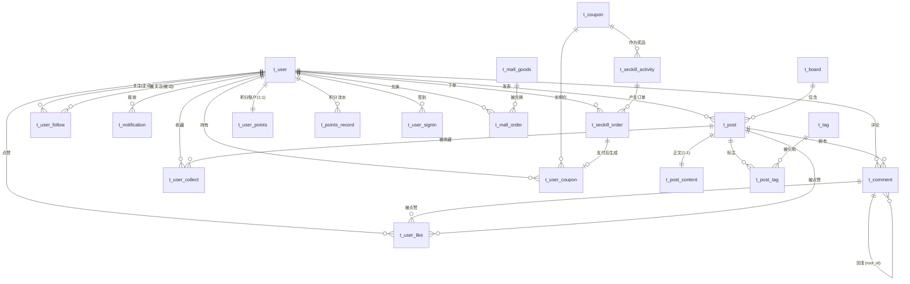

# 校园论坛系统 —— 数据库设计说明书

| 项目 | 内容 |
|---|---|
| 数据库 | MySQL 8.0.30+ |
| 字符集 / 排序规则 | utf8mb4 / utf8mb4_0900_ai_ci |
| 存储引擎 | InnoDB |
| 对应脚本 | `sql/01-schema.sql`（建表）、`sql/02-init-data.sql`（种子数据） |
| 文档版本 | V1.0 / 2026-09-14 |

---

## 1. 设计规范

### 1.1 命名规范

| 对象 | 规则 | 示例 |
|---|---|---|
| 表名 | `t_` + 小写下划线，单数名词 | `t_post`、`t_seckill_order` |
| 字段名 | 小写下划线，避免 MySQL 保留字 | `create_time`、`target_type` |
| 主键 | 统一为 `id` | `id` |
| 外键字段 | `<关联表单数>_id` | `post_id`、`user_id` |
| 布尔语义字段 | `is_` 前缀 | `is_read`、`is_author` |
| 计数冗余字段 | `_count` 后缀 | `like_count`、`comment_count` |
| 时间字段 | `_time` 后缀 | `publish_time`、`expire_time` |
| 唯一索引 | `uk_` + 字段名缩写 | `uk_user_target` |
| 普通索引 | `idx_` + 字段名缩写 | `idx_board_list` |
| 全文索引 | `ft_` + 字段名缩写 | `ft_title_summary` |

### 1.2 字段设计规范

| 规范 | 说明 |
|---|---|
| 主键 | 统一 `BIGINT UNSIGNED AUTO_INCREMENT`。应用层可用 MyBatis-Plus 雪花 ID，DB 自增作为兜底 |
| 金额 | 一律 `DECIMAL(10,2)`，**禁止 FLOAT/DOUBLE**（浮点误差会导致对账不平） |
| 时间 | 一律 `DATETIME`，**禁止 TIMESTAMP**（2038 问题 + 隐式时区转换） |
| 字符串 | 必须显式指定长度；短文本用 `VARCHAR`，正文用 `MEDIUMTEXT` |
| 枚举 | 用 `TINYINT` 存状态码，**不使用 ENUM 类型**（加值需 DDL，且排序按索引值不符合直觉） |
| JSON | 仅在「结构不固定且不需要索引」时使用（如图片数组、扩展数据） |
| 非空 | 字段尽量 `NOT NULL` + 默认值。`NULL` 会破坏索引统计、让 `COUNT` 与比较运算出现意外 |

### 1.3 不使用统一逻辑删除列（重要决策）

本设计**没有**为每张表加 `deleted TINYINT DEFAULT 0`，而是由各表的 `status` 字段承担状态语义。理由：

1. **业务状态本就多样**。帖子的状态有草稿、已发布、待审核、审核驳回、已删除、已下架六种，单一 `deleted` 无法表达。用 `status` 表达后，业务语义集中在一个字段上，可读性更好。
2. **逻辑删除列会污染索引**。若所有查询都带 `WHERE deleted = 0`，则不含该列的复合索引（如 `idx_board_list`）无法完全生效，需要把 `deleted` 追加到每个索引末尾，导致索引体积无谓膨胀。
3. **`deleted` 会让唯一索引失效**。以 `t_user_like` 为例，取消点赞后再点赞需要重新插入同一 `(user_id, target_type, target_id)` 组合。若用逻辑删除，唯一索引会拦截插入。用 `status` 语义 + 物理删除则天然可用。

**例外**：对于「删除后仍需保留行、且需要唯一约束」的场景（如 `t_user` 注销），通过让 `uk_username` 保持有效来防止他人冒名注册被注销的用户名——这是一个有意的产品决策，而非疏漏。

### 1.4 冗余计数字段的一致性约定

`likes_count`、`comment_count`、`view_count`、`follow_count` 等字段都是**冗余字段**，属于最终一致数据：

| 项 | 说明 |
|---|---|
| 实时真相 | **Redis**。用户点赞后立刻看到数字变化，读的是 Redis 的计数 |
| 最终真相 | **MySQL**。由 MQ 消费者批量刷写，是容灾与统计的基准 |
| 允许延迟 | 秒级（P99 < 1s） |
| 漂移修复 | 每日凌晨 3:00 全量对账任务，以明细表实际行数修正冗余计数 |

---

## 2. ER 关系图



> 注：`t_user_like` 通过 `target_type` 多态关联 `t_post` 与 `t_comment`，ER 图上体现为两条独立关系线。`t_post_tag` 为 `t_post` 与 `t_tag` 的多对多中间表。
>
> `forum:points:signin:{userId}:{yyyyMM}` 这个 Bitmap **不在这张图里**：它不是表，而是 `t_user_signin`
> 的派生缓存（详见 5.7）。把它画进 ER 图会让人误以为它承载了数据真相。

---

## 3. 表清单

### 3.1 按领域划分

| 领域 | 表名 | 中文名 | 预估量级（3 年） |
|---|---|---|---|
| 用户域 | `t_user` | 用户表 | 5 万 |
| 用户域 | `t_user_follow` | 关注关系表 | 50 万 |
| 论坛域 | `t_board` | 板块表 | 20 |
| 论坛域 | `t_post` | 帖子主表 | 200 万 |
| 论坛域 | `t_post_content` | 帖子正文表（垂直分表） | 200 万 |
| 论坛域 | `t_comment` | 评论表 | 2000 万 |
| 论坛域 | `t_user_like` | 点赞记录表 | **8000 万（最大）** |
| 论坛域 | `t_user_collect` | 收藏表 | 300 万 |
| 论坛域 | `t_tag` | 标签表 | 500 |
| 论坛域 | `t_post_tag` | 帖子标签关联表 | 600 万 |
| 通知域 | `t_notification` | 通知表 | 3000 万 |
| 营销域 | `t_coupon` | 优惠券模板表 | 100 |
| 营销域 | `t_seckill_activity` | 秒杀活动表 | 500 |
| 营销域 | `t_user_coupon` | 用户优惠券表 | 100 万 |
| 营销域 | `t_seckill_order` | 秒杀订单表 | 100 万 |
| 积分域 | `t_user_points` | 积分账户表 | 5 万（1 用户 1 行） |
| 积分域 | `t_points_record` | 积分流水表 | 2000 万（最活跃） |
| 积分域 | `t_user_signin` | 签到记录表 | 1500 万（5 万人 × 300 天） |
| 积分域 | `t_mall_goods` | 商城商品表 | 500 |
| 积分域 | `t_mall_order` | 兑换订单表 | 50 万 |
| 基础设施 | `t_mq_message` | 本地消息表 | 1 亿（按 7 天清理） |
| 基础设施 | `t_mq_consume_log` | 消费幂等日志表 | 5 亿（按 7 天清理） |
| 基础设施 | `t_mq_benchmark_result` | 压测结果记录表 | 1000 |

### 3.2 表的增长特征与治理策略

| 表 | 增长特征 | 治理策略 |
|---|---|---|
| `t_mq_consume_log` | 每条消息一行，写入量极大 | **保留 7 天**，定时任务分批删除（`WHERE create_time < ? LIMIT 5000` 循环） |
| `t_mq_message` | 每条可靠消息一行 | 状态为「已消费」且超过 7 天的记录归档到历史表后删除 |
| `t_user_like` | 长期累积，只增不减 | 月度分区或按 `target_id` 哈希分表；冷数据（1 年以上）归档 |
| `t_notification` | 长期累积 | 用户删除通知则物理删除；1 年以上数据归档 |
| `t_comment` | 长期累积 | 3 年以上归档到 `t_comment_archive` |
| `t_points_record` | 长期累积，只增不减 | **不归档**——它是积分余额的唯一解释来源，用户随时可能查历史明细；靠 `(user_id, id)` 索引把单用户查询限制在几十行内 |
| `t_user_signin` | 每人每天最多一行 | 一年一表（`t_user_signin_2026`）或按 `year_month` 分区；3 年以上归档 |
| `t_mall_order` | 低频，量级远小于点赞 | 无需特殊治理；用户注销时跟随清理 |

---

## 4. 核心表设计说明

以下逐表说明关键字段与索引的设计理由。完整 DDL 见 `sql/01-schema.sql`。

### 4.1 `t_user` 用户表

**关键字段**

| 字段 | 设计说明 |
|---|---|
| `password` | 存 BCrypt 密文（固定 60 字符），`VARCHAR(100)` 预留算法升级空间 |
| `student_no` | `UNIQUE` 且允许 `NULL`。MySQL 唯一索引允许多行为 `NULL`，因此未绑定学号的用户不会互相冲突 |
| `role` / `status` | 两个独立的维度。`role` 决定权限，`status` 决定账号是否可用，不能合并 |
| `level` / `exp` | 经验值与等级分离存储，等级可随规则调整随时重算，不必改历史数据 |
| `last_login_ip` | `VARCHAR(45)`，兼容 IPv6 的 39 字符 + 端口 |

**索引**

| 索引 | 用途 |
|---|---|
| `uk_username` | 登录查询 + 用户名唯一 |
| `uk_student_no` | 学号唯一（`NULL` 不参与唯一性判定） |
| `idx_nickname` | 昵称搜索 |
| `idx_status_create` | 后台按状态筛选用户列表 |

### 4.2 `t_post` + `t_post_content` 垂直分表

**为什么拆表？**

帖子正文是 `MEDIUMTEXT`，平均 2–5 KB，而列表页只需要标题、摘要、作者、计数等约 200 字节的字段。若两者同表：

- 单行长度从 ~200B 膨胀到 ~5KB，一个 16KB 的数据页只能容纳 3 行（拆分后可容纳 80 行）
- 列表分页查询扫描同样的页数，却只能取到 1/25 的数据，**Buffer Pool 有效容量下降约 25 倍**
- `ORDER BY publish_time` 的排序过程需要搬运更大的行，排序代价上升

拆表后，列表查询可完全在 `t_post` 内完成，正文仅在详情页按主键查一次 `t_post_content`（主键查聚簇索引，零回表）。

**`t_post` 索引设计**

> ⚠️ 下表中每个列表索引末尾的 `id DESC` **不是装饰，是必需的**（见第 1.5 节的实测结论）。移除后对应的游标分页查询会退化为 `Using filesort`。

| 索引 | 覆盖场景 | 设计要点 |
|---|---|---|
| `idx_board_list` | 板块内帖子列表（最新） | `(board_id, status, type, publish_time DESC, id DESC)`。`type` 作为等值条件固定为 `0`（普通帖），**置顶/精华/公告帖由 `idx_pinned` 单独查询**，理由见下 |
| `idx_board_hot` | 板块内热度榜 | `(board_id, status, type, hot_score DESC, id DESC)`。`hot_score` 由定时任务 **5 分钟批量刷新一次**，而非每次点赞都更新，避免高频写导致索引页反复分裂 |
| `idx_user_list` | 「我的帖子」 | `(user_id, status, publish_time DESC, id DESC)` |
| `idx_last_comment` | 「最新回复」排序 | `(board_id, status, type, last_comment_time DESC, id DESC)` |
| `idx_publish_time` | 全站最新帖 | `(status, publish_time DESC, id DESC)`，不限定板块时的兜底排序索引 |
| `idx_pinned` | 置顶/精华/公告帖 | `(board_id, status, type)`。结果集极小（每板块通常 < 10 条），**整体缓存 1 小时**，允许 filesort |
| `ft_title_summary` | 全文检索 | ngram 分词器（`ngram_token_size=2`），支持中文二字词检索。已在 MySQL 8.4 实测通过 |

**为什么置顶帖要从列表查询中剥离？**

原设计（`idx_board_list` 用 `type DESC` 打头以匹配 `ORDER BY type DESC, publish_time DESC`）存在两个问题：

1. **置顶帖数量与列表分页无关，却参与了每一页的排序**。`type` 是范围条件（`type != 0`）而非等值条件，一旦它在索引中是排序键的前导列，MySQL 就无法用该索引同时满足「范围扫描 + 有序输出」，必然 filesort。
2. **游标分页的复杂度上升**。若把 `type` 纳入游标，游标变成 `(type, publish_time, id)` 三元组，边界判断繁琐且易错。

**剥离后**：列表页只查 `type = 0`（等值，索引友好），置顶帖单独一次查询（结果集极小，直接缓存 1 小时），前端把两部分拼接展示。这是主流论坛产品的通行做法。

### 1.5 游标分页的索引规则（实测结论）

本节结论由 MySQL 8.4 实测得出（`EXPLAIN` 验证 14 条关键查询），是设计本项目所有列表索引时**必须遵守的硬性规则**。

**规则：凡是支持游标分页的索引，若排序键包含 `DESC` 列，必须在索引末尾显式追加同方向的 `id DESC`。**

**为什么？** InnoDB 的二级索引会隐式包含主键列，但这个隐式主键**方向固定为 ASC**。以 `idx_board_list` 为例：

```
不追加 id 时，索引物理顺序为：
  (board_id ASC, status ASC, type ASC, publish_time DESC, id ASC)
                                              ^^^^^^^_隐式主键，方向不可控

而游标分页的排序要求是：
  ORDER BY publish_time DESC, id DESC
                                    ^^^^^^ 方向不匹配 → Using filesort
```

`publish_time` 能匹配，但紧随其后的 `id` 方向相反，MySQL 无法利用索引完成排序，只能把结果取回后 filesort。**追加显式的 `id DESC` 后，索引物理顺序与排序要求完全一致，filesort 消失。**

**反例（无需追加的情况）**：`t_comment` 的两个列表索引**不需要**追加 `id DESC`。因为它们的排序键 `ORDER BY floor, id` 与 `ORDER BY create_time, id` **全部为 ASC**，与隐式主键方向一致，InnoDB 已能直接满足。实测证实这两个查询本就没有 filesort。

**实测对照表**：

| 查询 | 修复前 | 修复后 |
|---|---|---|
| 板块列表 + 游标 | `idx_board_list` + filesort | `idx_board_list`，无 filesort |
| 热度榜 + 游标 | `idx_board_hot` + filesort | `idx_board_hot`，无 filesort |
| 我的帖子 + 游标 | `idx_user_list` + filesort | `idx_user_list`，无 filesort |
| 最新回复 + 游标 | `idx_last_comment` + filesort | `idx_last_comment`，无 filesort |
| 一级评论 `ORDER BY floor, id` | 无 filesort | 无 filesort（无需修改） |
| 二级回复 `ORDER BY create_time, id` | 无 filesort | 无 filesort（无需修改） |

**验证方法**（可随时回归）：

```sql
EXPLAIN SELECT id FROM t_post
WHERE board_id = 2 AND status = 1 AND type = 0
  AND (publish_time, id) < ('2026-09-01 09:30:00', 100)
ORDER BY publish_time DESC, id DESC LIMIT 20;
-- Extra 列必须不含 "Using filesort"
```

**`status` 与 `type` 的语义分离**：`status` 描述生命周期（草稿/发布/待审/驳回/删除/下架），`type` 描述内容属性（普通/置顶/精华/公告）。二者独立变化——一个帖子可以是「已发布 + 精华」，也可以是「已下架 + 精华」（下架后加精记录保留）。

### 4.3 `t_comment` 评论表 —— 两级模型

**模型选择**

| 方案 | 优点 | 缺点 | 结论 |
|---|---|---|---|
| 无限级树（`parent_id` 递归） | 表达力强 | 查询需递归或闭包表，深度不可控 | 否 |
| **两级模型**（本方案） | 查询简单，一次 `WHERE root_id = ?` 取出全部回复 | 无法表达「回复的回复的回复」的缩进 | **采用** |
| 路径枚举 / 嵌套集 | 子树查询快 | 写入代价高，维护复杂 | 否 |

两级模型是主流论坛（贴吧、V2EX、掘金）的实际选择：**读者不关心回复的回复属于第几层，只关心「这条评论在说什么」**。所有二级评论平铺展示在一级评论下方，用 `reply_user_id` 渲染出「回复 @某某」即可表达上下文。

**关键字段**

| 字段 | 说明 |
|---|---|
| `root_id` | 一级评论为 0；二级评论指向所属一级评论。**这是模型的核心**，使「取某条评论的全部回复」变成一次索引查询 |
| `parent_id` | 直接父评论 ID。仅用于渲染「回复 @某某」，不参与查询主路径 |
| `reply_user_id` | 被回复的用户 ID，冗余存储避免查询时联表取昵称 |
| `floor` | 楼层号，仅一级评论有值。**由 Redis `INCR comment:floor:{postId}` 生成**，而非 `COUNT(*)`——后者在并发下会取到相同值 |
| `is_author` | 楼主标识，写入时判定并冗余，避免展示时比对 `post.user_id` |
| `status` | 删除评论时置 `status=3` 而非物理删除，前端渲染为「该评论已删除」。原因：直接消失会破坏楼中楼的上下文（有人回复了它，它却不见了） |

**索引**

| 索引 | 覆盖场景 |
|---|---|
| `idx_post_l1` `(post_id, status, level, floor)` | 帖子详情页一级评论按楼层分页 |
| `idx_root_reply` `(root_id, status, create_time)` | 展开某条一级评论的二级回复 |
| `idx_user_list` `(user_id, status, create_time DESC)` | 「我的评论」 |
| `idx_parent` `(parent_id)` | 按父评论聚合（删除时级联处理） |

### 4.4 `t_user_like` 点赞表 —— 统一表设计

**为什么帖子点赞和评论点赞用同一张表？**

| 维度 | 统一表（本方案） | 分成两张表 |
|---|---|---|
| 代码复用 | 判重、落库、计数、对账逻辑**完全一套** | 两套高度相似的代码 |
| 扩展性 | 新增可点赞实体（动态、回答）零成本 | 每新增一种就加一张表 |
| 索引效率 | 靠 `target_type` 前缀区分，效率相同 | 各自索引更紧凑，略优 |
| 单表膨胀 | 更快（8000 万行） | 分散到两张表 |
| 热点集中 | 热门帖子点赞集中在同一批页 | 略分散 |

**结论**：校园论坛量级下，代码复用与扩展性远比索引紧凑性重要，且两张表最终都要面对分表问题，统一表只是让分表来得更早一点。**采用统一表。**

**索引**

| 索引 | 用途 |
|---|---|
| `uk_user_target (user_id, target_type, target_id)` | **幂等兜底**。MQ 重复投递时由它拦截，业务代码捕获 `DuplicateKeyException` 即可 |
| `idx_target (target_type, target_id, create_time DESC)` | 「谁赞了这条帖子」列表 |
| `idx_owner (target_owner_id, create_time DESC)` | 「我收到的赞」时间线 |

**为什么没有 `status` 字段**：取消点赞即物理 `DELETE`。若用逻辑删除，`uk_user_target` 会阻止用户「取消后再点赞」，或需要把 `status` 加进唯一索引导致同一组合出现多行。物理删除是最干净的方案。

### 4.5 `t_seckill_activity` 秒杀活动表 —— 库存三层模型

这是秒杀防超卖的核心数据结构：

```
                       total_stock（不变量）
                             │
        ┌────────────────────┼────────────────────┐
        ▼                    ▼                    ▼
 available_stock       locked_stock         sold_count
   （可售）            （已下单未支付）        （已支付）
        │                    │                    │
   下单时 -1             下单时 +1            支付时 +1
                        超时取消时 -1         同时 locked -1
```

**恒等式**：`total_stock = available_stock + locked_stock + sold_count`

该恒等式在**任何时刻**都必须成立，是所有对账任务的校验基准。活动结束时 `locked_stock` 和 `available_stock` 必须都归零。

**三层库存的职责**

| 层 | 存储 | 职责 | 一致性 |
|---|---|---|---|
| 第一层 | Redis `seckill:stock:{id}` | 抗洪峰。10000 QPS 全部打在 Redis 上，DB 只承受最终成功的 1000 次写入 | 最终一致，每 5 分钟对账 |
| 第二层 | `available_stock` | DB 最终真相。扣减用 `UPDATE ... WHERE available_stock >= 1` 的条件更新 | 强一致 |
| 第三层 | `locked_stock` | 追踪「已下单未支付」的库存，超时后回补 | 强一致 |

**`version` 乐观锁的使用边界**：`version` 列**不参与秒杀主链路**（主链路靠 Redis 预扣 + 条件 UPDATE 已足够），仅用于后台人工调整库存等低频写场景，防止两位管理员同时修改造成覆盖。

**积分秒杀的扩展列（本项目的秒杀形态）：**

秒杀商品直接引用积分商城的商品（`t_mall_goods`），但**商品资料在创建活动时快照进来**，热路径不跨模块查库：

| 列 | 说明 |
|---|---|
| `goods_id` | 关联的商城商品 ID，创建活动时经 `MallAdminApi` 校验 |
| `goods_name` / `goods_cover` / `goods_type` | 商品资料快照。理由与订单冗余 `goods_name` 相同：抢购是热路径；商品改名也不该改写历史活动 |
| `points_cost` | 秒杀价（积分）。与商品的 `points_price` 分开，即「秒杀便宜多少」由活动决定而不是改商品本身 |
| `coupon_id` | 由 `NOT NULL` 改为**可空**：积分秒杀卖的是商品，不强制发券 |

### 4.6 `t_seckill_order` 秒杀订单表 —— 防超卖最后防线

**`uk_user_activity (user_id, activity_id)` 是整个秒杀链路中最重要的一个索引。**

秒杀链路有五层防护，这个唯一索引是最后一层：

| 层 | 防护手段 | 拦截的问题 |
|---|---|---|
| 1 | 前端按钮点击后置灰 | 用户误操作、手抖连点 |
| 2 | Lua 中「已有 orderNo 直接返回」 | 重复提交（**幂等重放**，返回同一张单） |
| 3 | Redis `HINCRBY` 判限购 | 同一用户并发请求 |
| 4 | Redis `DECR` 库存判断 | 库存超卖（内存层） |
| 5 | **`uk_user_activity`** | **前四层全部失效时的最终兜底** |
| 6 | `UPDATE ... WHERE available_stock >= 1` | DB 层库存超卖 |

有了第 5 层，即使 Redis 被清空、MQ 消息重复投递一百次，也不会产生同一用户的第二笔订单。消费端捕获 `DuplicateKeyException` 后按「已下单」处理即可，实现天然幂等。

**积分秒杀附加的列：**

| 列 | 说明 |
|---|---|
| `goods_id` / `goods_name` | 商品 ID 与名称快照。订单是历史凭证，商品改名后订单页仍要显示当时兑换的是什么 |
| `points_cost` | 本次消耗的积分数（积分秒杀用积分支付，不走 `pay_amount`） |

**状态语义**：`0 待支付 1 已支付(待发放) 2 已取消 3 超时关闭 4 已退款 5 已完成`。
`5 已完成` 由管理员发放后写入，与商城订单的「待发放 → 已完成」保持一致。

**⚠️ 重要的前提约束**：该唯一索引成立的前提是 **`per_user_limit = 1`**。若业务要求一人可买多张，必须：

1. 将 `uk_user_activity` 改为普通索引 `idx_user_activity (user_id, activity_id)`
2. 将防重职责完全上移到 Redis（Lua 中把限购判断改为 `HINCRBY seckill:bought:{id} {userId} 1` 并判断是否超过限额，现在已经是这个写法，故只需改索引）
3. 订单表的唯一约束改为 `(user_id, activity_id, seq)`，其中 `seq` 由 Redis `INCR` 生成

本项目按校园场景设定为每人限领 1 张，保留唯一索引以获得最强的防重保证。

**为什么取消订单不删除 Redis 里的用户标记**：本产品的「每人限购 1 件」是**活动期内的一次性资格**，不是「同时最多持有 1 件」。取消只退还库存，不退还资格，因此用户取消后不能再次抢购——上表的 `uk_user_activity` 是这条约束的最终保证（取消的订单行仍在，第二单在 DB 层也插不进去）。

### 4.7 `t_mq_message` 本地消息表

**解决的问题**：业务事务提交成功，但消息发送失败——点赞已生效，落库消息却丢了。

**工作流程**：

```
业务事务开始
   ├── 执行业务写操作（如写 Redis 点赞状态）
   └── INSERT t_mq_message (status=0 待发送)   ← 与业务操作在同一事务
业务事务提交
   ↓
投递线程轮询：SELECT * FROM t_mq_message
             WHERE status IN (0,2) AND next_retry_time <= NOW() LIMIT 100
   ↓
发送到 MQ
   ├── 成功 → UPDATE status=1
   └── 失败 → UPDATE status=2, retry_count+1,
              next_retry_time = NOW() + 2^retry_count 秒（指数退避）
```

**`provider` 字段的作用**：记录该条消息实际走的中间件实现（`kafka` / `rabbitmq`）。这是本项目的特殊需求——因为需要在两种 MQ 之间切换并对比，有了这一列才能按实现维度统计发送成功率与耗时：

```sql
SELECT provider,
       COUNT(*)                                              AS total,
       SUM(status = 1) / COUNT(*)                            AS success_rate,
       AVG(TIMESTAMPDIFF(MILLISECOND, create_time, update_time)) AS avg_send_ms
FROM t_mq_message
WHERE biz_type = 'LIKE_CHANGED'
  AND create_time > DATE_SUB(NOW(), INTERVAL 1 HOUR)
GROUP BY provider;
```

### 4.8 `t_mq_consume_log` 消费幂等日志表（兼压测埋点）

**双重身份**：

1. **幂等去重**：`uk_msg_consumer (message_id, consumer_group)` 保证同一条消息在同一消费组内只被处理一次。这是 MQ 层面「至少一次投递」语义的补偿——**所有 MQ 都只保证 at-least-once，因此幂等必须由消费端自己实现**，这是 Kafka 与 RabbitMQ 切换时唯一不变的约束。
2. **压测埋点**：`cost_ms` 列由消费切面自动记录每条消息的处理耗时，`provider` 列记录实现类型。二者组合，无需额外压测工具即可从本表直接聚合出性能对比数据。

```sql
-- 端到端消费延迟分布对比（压测核心查询）
SELECT provider,
       topic,
       COUNT(*)                                                    AS msg_count,
       ROUND(AVG(cost_ms), 2)                                      AS avg_ms,
       MAX(cost_ms)                                                AS max_ms,
       ROUND(SUM(CASE WHEN cost_ms <= 10 THEN 1 ELSE 0 END) / COUNT(*) * 100, 2) AS p_le_10ms_pct
FROM t_mq_consume_log
WHERE create_time > DATE_SUB(NOW(), INTERVAL 1 HOUR)
GROUP BY provider, topic;
```

**清理策略**：此表增长最快（每条消息一行），按 `create_time` **保留 7 天**，由定时任务分批删除。压测期间可临时调大保留窗口，压测结束后手动导出结果到 `t_mq_benchmark_result`。

### 4.9 `t_mq_benchmark_result` 压测结果记录表

把 Kafka / RabbitMQ 的对比实验**结构化沉淀**，使「换实现 → 重跑压测 → 查表对比」成为可重复的流程，而不是一次性手写报告。

**可比性设计**：每次压测以一个 `batch_no` 标识，同批次下两种 `provider` 使用完全相同的参数列（`scenario`、`concurrency`、`partition_count`、`consumer_count`、`batch_size`、`ack_mode`）。查询对比：

```sql
SELECT scenario, concurrency, partition_count, batch_size,
       MAX(CASE WHEN provider = 'kafka'    THEN produce_qps END) AS kafka_produce_qps,
       MAX(CASE WHEN provider = 'rabbitmq' THEN produce_qps END) AS rmq_produce_qps,
       MAX(CASE WHEN provider = 'kafka'    THEN p99_ms      END) AS kafka_p99,
       MAX(CASE WHEN provider = 'rabbitmq' THEN p99_ms      END) AS rmq_p99,
       MAX(CASE WHEN provider = 'kafka'    THEN cpu_peak_pct END) AS kafka_cpu,
       MAX(CASE WHEN provider = 'rabbitmq' THEN cpu_peak_pct END) AS rmq_cpu
FROM t_mq_benchmark_result
WHERE batch_no = ?
GROUP BY scenario, concurrency, partition_count, batch_size;
```

### 4.10 `t_user_points` 积分账户表

```sql
CREATE TABLE `t_user_points` (
    `id`           BIGINT UNSIGNED NOT NULL AUTO_INCREMENT COMMENT '主键',
    `user_id`      BIGINT UNSIGNED NOT NULL COMMENT '用户ID',
    `balance`      INT UNSIGNED    NOT NULL DEFAULT 0 COMMENT '可用积分余额',
    `total_earned` INT UNSIGNED    NOT NULL DEFAULT 0 COMMENT '累计获得积分',
    `total_spent`  INT UNSIGNED    NOT NULL DEFAULT 0 COMMENT '累计消耗积分',
    ...
    PRIMARY KEY (`id`),
    UNIQUE KEY `uk_user` (`user_id`)
) COMMENT ='积分账户表';
```

**不变式**：`balance = total_earned - total_spent`。

**为什么账户独立成表，而不是给 `t_user` 加一列：**

1. `t_user` 是热点表——每次登录都要更新 `last_login_time`。把「每次签到/兑换都会变动」的积分列放进去，
   等于让积分操作去和登录抢同一行的行锁。
2. 更关键的是**事务边界**：扣积分、写订单、记流水三者必须在同一个事务里，
   它们都属于积分域。若余额在 `t_user`，这个事务就得跨模块写表（forum-points 写 forum-user 的表），
   模块边界当场失效，回滚语义也变得难以推理。

**为什么允许 `balance` 这样的冗余列存在：** 它是「高频读取、低频写入」的典型——每次进签到页都要读，
而每次变动都伴随一条流水。用不变量（9.6 节的校验任务）约束它，比每次读的时候去 `SUM` 流水划算得多。

### 4.11 `t_points_record` 积分流水表

```sql
CREATE TABLE `t_points_record` (
    `id`            BIGINT UNSIGNED NOT NULL AUTO_INCREMENT COMMENT '主键',
    `user_id`       BIGINT UNSIGNED NOT NULL COMMENT '用户ID',
    `change_amount` INT             NOT NULL COMMENT '积分变动，正为获得、负为消耗',
    `balance_after` INT UNSIGNED    NOT NULL COMMENT '变动后余额（快照，便于对账与排查）',
    `biz_type`      TINYINT         NOT NULL COMMENT '业务类型 1签到 2月度全勤奖励 3商城兑换 4兑换取消退回 5管理员调整(预留)',
    `biz_id`        VARCHAR(64)     NOT NULL COMMENT '业务标识：签到 yyyy-MM-dd / 奖励 yyyy-MM / 订单 order_no',
    `remark`        VARCHAR(128)    NOT NULL DEFAULT '' COMMENT '备注',
    ...
    PRIMARY KEY (`id`),
    UNIQUE KEY `uk_user_biz` (`user_id`, `biz_type`, `biz_id`),
    KEY `idx_user_id` (`user_id`, `id` DESC)
) COMMENT ='积分流水表';
```

**`uk_user_biz` 是本表存在的核心理由**：它是「同一笔业务只能记一次账」的最后防线。
签到接口被重放、月度奖励任务重复执行、取消订单接口并发调用——这些都可能发生，
而 Redis 去重会失效、条件 UPDATE 在特定顺序下也可能重复执行。唯一索引不会失效。

**`biz_id` 用业务标识而不是外键 ID：** 月度奖励没有对应的业务行（它不是某条记录触发的），
用一个字符串语义标识（`2026-08`）可以覆盖所有类型，而不必为「无对应行」的场景造一张空表。

**`balance_after` 是快照而不是真相：** 它的价值在于排查「用户说积分不对」时，
一眼就能看出是从哪一笔开始偏离的——没有它，只能把全部流水重算一遍。

**游标分页用 `id` 而不是 `create_time`：** 流水是纯追加的，`id` 与时间同序，
而 `id` 是主键、无精度问题、也不用担心同秒多条。

### 4.12 `t_user_signin` 签到记录表

```sql
CREATE TABLE `t_user_signin` (
    `id`          BIGINT UNSIGNED NOT NULL AUTO_INCREMENT COMMENT '主键',
    `user_id`     BIGINT UNSIGNED NOT NULL COMMENT '用户ID',
    `signin_date` DATE            NOT NULL COMMENT '签到日期',
    `year_month`  CHAR(7)         NOT NULL COMMENT '所属年月 yyyy-MM（冗余，供月度结算）',
    `points`      INT UNSIGNED    NOT NULL DEFAULT 0 COMMENT '当次获得积分',
    ...
    PRIMARY KEY (`id`),
    UNIQUE KEY `uk_user_date` (`user_id`, `signin_date`),
    KEY `idx_month_user` (`year_month`, `user_id`)
) COMMENT ='签到记录表';
```

**`year_month` 是刻意的冗余列。** 月度全勤结算要按 `WHERE year_month = ?` 过滤，
若写成 `WHERE DATE_FORMAT(signin_date, '%Y-%m') = ?`，函数会让索引失效，
这个**每天都要跑**的查询就退化成全表扫描。

**`uk_user_date` 的意义**：Redis Bitmap 是判定与统计的加速器，本表才是真相。
唯一索引保证「同一天不可能有两行」，因此任何重复请求最多让位图多一次 `SETBIT`，绝不会多发积分。

### 4.13 `t_mall_goods` 商城商品表

```sql
CREATE TABLE `t_mall_goods` (
    `id`           BIGINT UNSIGNED NOT NULL AUTO_INCREMENT COMMENT '商品ID',
    `name`         VARCHAR(64)     NOT NULL COMMENT '商品名称',
    `cover_image`  VARCHAR(512)    NOT NULL DEFAULT '' COMMENT '封面图',
    `description`  VARCHAR(1024)   NOT NULL DEFAULT '' COMMENT '商品描述',
    `type`         TINYINT         NOT NULL DEFAULT 1 COMMENT '类型 1优惠券 2实物 3虚拟物品',
    `points_price` INT UNSIGNED    NOT NULL DEFAULT 0 COMMENT '兑换所需积分',
    `stock`        INT UNSIGNED    NOT NULL DEFAULT 0 COMMENT '剩余库存',
    `sold_count`   INT UNSIGNED    NOT NULL DEFAULT 0 COMMENT '已兑换数量',
    `status`       TINYINT         NOT NULL DEFAULT 0 COMMENT '状态 0草稿 1上架 2下架',
    `sort_order`   INT             NOT NULL DEFAULT 0 COMMENT '排序权重，越大越靠前',
    ...
    KEY `idx_status_sort` (`status`, `sort_order` DESC, `id` DESC)
) COMMENT ='积分商城商品表';
```

**库存恒等式**：`stock + sold_count = 初值`。与秒杀的三层库存模型不同，这里只有两层——
商城是低频场景，没有「已下单未支付」的中间态（兑换即时扣减、即时完成），
多出来的 `locked_stock` 只会增加对账口径的复杂度。

**列表索引带 `sort_order DESC, id DESC`**：与 `t_post` 的列表索引是同一个教训（见 1.5 节）——
游标分页 `ORDER BY sort_order DESC, id DESC` 要求索引里这两个列的方向一致，否则 filesort。

### 4.14 `t_mall_order` 兑换订单表

```sql
CREATE TABLE `t_mall_order` (
    `id`          BIGINT UNSIGNED NOT NULL AUTO_INCREMENT COMMENT '订单ID',
    `order_no`    VARCHAR(32)     NOT NULL COMMENT '订单号 M+yyyyMMdd+6位日内序号',
    `user_id`     BIGINT UNSIGNED NOT NULL COMMENT '下单用户ID',
    `goods_id`    BIGINT UNSIGNED NOT NULL COMMENT '商品ID',
    `goods_name`  VARCHAR(64)     NOT NULL COMMENT '商品名称（下单时快照）',
    `goods_type`  TINYINT         NOT NULL DEFAULT 1 COMMENT '商品类型（下单时快照）',
    `points_cost` INT UNSIGNED    NOT NULL DEFAULT 0 COMMENT '消耗积分',
    `status`      TINYINT         NOT NULL DEFAULT 0 COMMENT '状态 0待发放 1已完成 2已取消',
    `remark`      VARCHAR(255)    NOT NULL DEFAULT '' COMMENT '备注',
    `finish_time` DATETIME                 DEFAULT NULL COMMENT '发放时间',
    `cancel_time` DATETIME                 DEFAULT NULL COMMENT '取消时间',
    ...
    UNIQUE KEY `uk_order_no` (`order_no`),
    KEY `idx_user_id` (`user_id`, `id` DESC),
    KEY `idx_status_id` (`status`, `id` DESC)
) COMMENT ='积分商城兑换订单表';
```

**为什么冗余 `goods_name` / `goods_type`：** 订单是历史凭证。商品改名、调价、下架之后，
订单页仍然要显示「当时兑换的是什么」。这与 `t_seckill_order` 冗余 `coupon_id` 是同一个理由，
但这里冗余的是**文本快照**——因为商品名是会被改的，而 ID 指向的当前值已经不是当初的样子了。

**没有 `uk_user_goods` 唯一索引**：商城允许同一用户重复兑换同一商品（库存与积分是唯一的约束），
这与秒杀「每人限购 1 件」的 `uk_user_activity` 恰好相反——限购与否是业务规则，不是技术选择。

---

## 5. 缓存 Key 设计规范

统一使用 `业务域:对象:标识[:子标识]` 三段式结构，冒号分隔，全部小写。

### 5.1 缓存类

| Key 模式 | 类型 | TTL | 说明 |
|---|---|---|---|
| `forum:post:detail:{postId}` | Hash | 30 min + 随机 0–300s | 帖子详情（不含正文） |
| `forum:post:content:{postId}` | String | 1 h + 随机 0–600s | 帖子正文 |
| `forum:board:list` | String(JSON) | 1 h | 板块列表 |
| `forum:post:list:{boardId}:{sort}` | ZSet | 10 min | 板块内帖子 ID 有序列表（score 为排序键） |
| `forum:post:hot:global` | ZSet | 10 min | 全站热帖榜 |
| `forum:comment:l1:{postId}` | ZSet | 10 min | 一级评论 ID 按楼层排序 |
| `forum:tag:hot` | ZSet | 30 min | 热门标签 |

### 5.2 计数类（实时真相）

| Key 模式 | 类型 | 说明 |
|---|---|---|
| `forum:like:target:{type}:{id}:count` | String | 点赞数实时值 |
| `forum:like:target:{type}:{id}:users` | Set | 点赞用户集合（判重 + 计数） |
| `forum:comment:floor:{postId}` | String | 楼层号发号器（`INCR`） |
| `forum:post:view:{postId}` | String | 浏览数缓冲计数（定时批量刷回 DB） |
| `forum:notif:unread:{userId}` | String | 未读通知数 |

### 5.3 秒杀类

| Key 模式 | 类型 | 说明 |
|---|---|---|
| `forum:seckill:stock:{activityId}` | String | 剩余可抢库存。预热时 `SETNX`，抢购时 `DECR`，取消/超时时 `INCR` 回补 |
| `forum:seckill:bought:{activityId}` | **Hash** | 已抢用户（`userId → 已抢数量`）。`HGET` 判限购、`HINCRBY` 累加。**取消订单时不删除**——限购是活动期内的一次性资格 |
| `forum:seckill:order:{activityId}:{userId}` | String | 该用户抢到的 `orderNo`。两个用途：① 重复点击时幂等重放，直接返回同一张单；② 作为结果查询的锚点 |
| `forum:seckill:order:no:{yyyyMMdd}` | String | 订单号日内序号（`INCR`，TTL 2 天）。订单号 = `S + yyyyMMdd + 6 位序号` |
| `forum:seckill:warmup:{activityId}` | String | 预热标记。值为 1 表示库存已加载；**抢购时缺它返回 15005（活动太火爆）而不是 15001（已抢光）** |
| `forum:seckill:activity:info:{activityId}` | Hash | 活动信息快照。抢购时用它判时间窗与状态，**不在热路径查库** |
| `forum:seckill:result:{activityId}:{userId}` | String | 抢购结果（`PENDING` / `SUCCESS` / `FAILED` / `TIMEOUT` / `CANCELLED`），供前端轮询 |

**为什么判重用 Hash 而不是 Set**：`HGET` 判 0/1 已经能满足「限购 1 件」，而 `HINCRBY` 让 `per_user_limit` 变成一个可配置参数——未来要放开一人多件，不必改 Lua 脚本和数据结构，只改配置与订单表的唯一索引（见 4.6 节）。

### 5.4 认证与限流类

| Key 模式 | 类型 | TTL | 说明 |
|---|---|---|---|
| `auth:token:{userId}:{deviceId}` | String | 30 min | Access Token 白名单（支持主动踢人） |
| `auth:refresh:{userId}:{deviceId}` | String | 7 d | Refresh Token |
| `auth:login:fail:{username}` | String | 15 min | 登录失败计数（5 次锁定） |
| `limit:api:{userId}:{api}` | String | 1 min | 接口限流计数 |

### 5.5 锁类（Redisson）

| Key 模式 | 说明 |
|---|---|
| `lock:seckill:activity:{activityId}` | 秒杀活动配置变更时的分布式锁（兜底，非主链路） |
| `lock:post:hot:recalc` | 热度重算任务的分布式锁（防止多实例重复执行） |
| `lock:stock:reconcile:{activityId}` | 库存对账任务的分布式锁 |
| `lock:user:register:{username}` | 注册防重锁 |

### 5.6 缓存问题防护

| 问题 | 场景 | 防护手段 |
|---|---|---|
| **缓存穿透** | 恶意查询不存在的帖子 ID | 布隆过滤器拦截非法 ID + 空值缓存（`""`，TTL 60s） |
| **缓存击穿** | 热帖缓存到期瞬间大量请求打到 DB | 逻辑过期（不设 TTL，值内带 `expireAt` 字段）+ 异步重建；或 Redisson 互斥锁 |
| **缓存雪崩** | 大量 Key 同时过期 | TTL 加随机扰动（基础 TTL + 0–600s 随机值） |
| **热点 Key** | 明星帖被疯狂访问 | Caffeine 本地缓存 + Redis 二级；本地缓存 TTL 5s，抗住瞬时峰值 |
| **大 Key** | 评论列表缓存过大 | 只缓存 ID 列表，详情按需回表；单 Value 控制在 10KB 内 |

### 5.7 积分与商城类

| Key 模式 | 类型 | TTL | 说明 |
|---|---|---|---|
| `forum:points:signin:{userId}:{yyyyMM}` | **Bitmap** | 70 天 | 签到位图，offset = 日 - 1；TTL 在首次 `SETBIT` 时设置 |
| `forum:points:balance:{userId}` | String | 不设 | 积分余额缓存（可选，读多写少时可加） |
| `forum:mall:order:no:{yyyyMMdd}` | String | 2 天 | 订单号的日内序号，`INCR` 生成；TTL 覆盖到跨天即可 |
| `lock:points:signin:{userId}` | Redisson | — | 签到兜底锁（位图已是原子的，仅在补齐 DB 时用） |
| `lock:points:bonus:{yyyyMM}` | Redisson | — | 月度全勤结算任务锁，防止多实例重复执行 |
| `lock:seckill:warmup:{activityId}` | Redisson | — | 秒杀预热任务锁，防止多实例重复加载库存 |

> **关于商城下单防连点**：设计早期曾计划用 `lock:mall:order:{userId}` 做「下单防连点」，**当前实现并未采用**。理由是同一条链路上已经有更可靠的手段：`t_mall_goods` 的条件 UPDATE（`WHERE stock >= 1`）与 `t_mall_order` 的状态条件更新，两处都以 `affectedRows` 判成败，不需要再引入一把锁。文档与代码不一致的锁，留着只会让人误以为某处有保护。

**为什么位图的 TTL 是 70 天：** 位图要跨越「当月统计」和「次月 1 日结算上月」两个时间点。
31 天 + 结算窗口 + 容错余量，70 天足够；再长就是纯粹的内存浪费
——按每用户每月 4 字节算，100 万用户的 70 天存量也只有约 30 MB。

**为什么余额缓存标注为「可选」：** 余额是强一致要求的数据，缓存意味着
「扣了积分但缓存没失效」的窗口。当前规模下 `SELECT` 单行走主键索引已是微秒级，
加缓存的收益不足以抵消这个风险。真正需要它的是「积分排行榜」那类读多写更多的场景，
届时应该缓存**排序结果**（ZSet），而不是缓存单用户余额。

---

## 6. 事务与并发控制

### 6.1 事务边界

| 场景 | 事务范围 | 说明 |
|---|---|---|
| 发帖 | `t_post` + `t_post_content` + `t_post_tag` | 同一事务，任一失败全部回滚 |
| 评论 | `t_comment` + `t_post` 计数更新 | 同一事务，计数与明细必须原子 |
| 点赞落库 | `t_user_like` + 计数更新 | 消费者内批量事务（每批 200 条） |
| 秒杀下单 | `t_seckill_order` + 库存更新 | 同一事务 |
| 支付 | 订单状态 + 库存转移 + 生成用户券 | 同一事务，三者的原子性至关重要 |
| 每日签到 | `t_user_signin` + `t_user_points` + `t_points_record` | 同一事务；**位图操作在事务之外**（见下方说明） |
| 月度全勤奖励 | 按用户逐条事务（每用户：`t_points_record` + `t_user_points`） | **不放大事务**：2000 个用户一个事务会长时间持有行锁 |
| 商城兑换 | `t_mall_order` + `t_mall_goods` 库存 + `t_user_points` + `t_points_record` | 同一事务，四者缺一不可 |
| 兑换取消退回 | 订单状态 + 库存回滚 + 积分退回 + 退款流水 | 同一事务 |

**禁止事项**：

- 禁止在事务中调用远程服务（HTTP / MQ 发送），否则长事务会拖垮连接池。**MQ 发送一律放在事务提交之后**，通过本地消息表保证可靠。
- 禁止在事务中做 Redis 写操作（Redis 失败会导致 DB 回滚，但 Redis 已生效，产生不一致）。**Redis 操作一律放在事务外或事务前**。

**签到为什么是这个顺序：** 先 `SETBIT` 再开事务，整体是

```
SETBIT（Redis，事务外） → 开事务 { INSERT t_user_signin + 加分 + 记流水 } → 提交
```

若反过来（先写库再置位），两个并发请求会**同时**读到「今天还没签」，双双通过 `SETBIT` 的判断，
最终只有唯一索引能拦住其中一个 —— 拦截表现为「抛异常 → 事务回滚」，是**失败**而不是幂等。
先置位则第二个请求在第一步就拿到 `prev = 1`，直接返回「今日已签到」，不会走到事务。<br>
代价是「位图已置位但事务回滚」时多算了一天，由 §8 的位图修复任务按 DB 真相修正
（这类不一致是**可自愈**的，反过来则不可自愈）。

### 6.2 并发控制手段选型

| 场景 | 手段 | 理由 |
|---|---|---|
| 秒杀库存扣减（Redis） | **Lua 脚本** | 单线程原子执行，无锁无竞争，性能最高 |
| 秒杀库存扣减（DB） | **条件 UPDATE** `WHERE available_stock >= 1` | 无需显式加锁，靠行锁 + 条件判断，失败即库存不足 |
| 同一用户防重复下单 | **唯一索引** | 最可靠，零额外开销 |
| 后台调整库存 | **乐观锁** `version` | 低频写，冲突概率低，无锁开销 |
| 热度重算任务 | **Redisson 分布式锁** | 防止多实例重复执行，任务耗时长需锁续期 |
| 楼层号生成 | **Redis INCR** | 原子自增，天然无竞争 |
| 用户注册 | **唯一索引** | 由 `uk_username` 拦截，捕获异常返回友好提示 |
| 每日签到去重（快路径） | **Redis Bitmap `SETBIT` 返回值** | 旧值即幂等信号，一次命令同时完成「判断 + 写入」，无需额外的 `SETNX` |
| 每日签到去重（兜底） | **唯一索引 `uk_user_date`** | 位图可能被误删/未持久化，唯一索引不会 |
| 商城扣积分 | **条件 UPDATE** `WHERE balance >= ?` | 与秒杀同理，失败即积分不足；**不引入 Redis 预扣**（理由见 03 文档 9.4） |
| 商城扣库存 | **条件 UPDATE** `WHERE stock >= 1` | 与秒杀同款写法，商城无中间态故无需 Redis 层 |
| 月度全勤结算 | **唯一索引 + 每日幂等重跑** | 任务漏跑一天不会永久丢奖励，重跑时靠 `uk_user_biz` 挡住重复记账 |
| 订单号生成 | **Redis INCR** | `M + yyyyMMdd + 6 位日内序号`；位数固定保证按字典序即按时间序 |

---

## 7. 演进方案：分库分表

### 7.1 触发时机

| 表 | 触发阈值 | 优先级 |
|---|---|---|
| `t_user_like` | 2000 万行 或 单表 > 20GB | 高（最先触发） |
| `t_comment` | 2000 万行 | 中 |
| `t_notification` | 2000 万行 | 中 |
| `t_post` | 500 万行 | 低 |

### 7.2 分片方案

**`t_user_like` 分片键选择**

| 方案 | 优点 | 缺点 |
|---|---|---|
| 按 `user_id` 分片 | 「我赞过的」查询可定位单分片 | 「谁赞了这条帖子」需广播到所有分片 |
| 按 `target_id` 分片 | 「某帖的点赞列表」可定位单分片；热门帖数据集中 | 「我赞过的」需广播 |

**结论**：论坛场景下「查看某帖点赞列表」是高频只读操作（帖子详情页展示点赞用户），而「我赞过的」是低频个人页操作。**选择按 `target_id` 分片**，`user_id` 维度通过 Redis Set 直接满足（用户点赞状态本就存在 Redis 中），无需查库。

**分片数**：16 个分片，按 `target_id % 16`。选用 2 的幂次便于后续翻倍扩容（16 → 32 时数据迁移量减半）。

**实施方式**：使用 ShardingSphere-JDBC，在应用层透明分片，业务代码中的 `Mapper` 接口无需改动。

```yaml
spring:
  shardingsphere:
    rules:
      sharding:
        tables:
          t_user_like:
            actual-data-nodes: ds0.t_user_like_$->{0..15}
            table-strategy:
              standard:
                sharding-column: target_id
                sharding-algorithm-name: like-mod
        sharding-algorithms:
          like-mod:
            type: MOD
            props:
              sharding-count: 16
```

### 7.3 平滑迁移步骤

1. **双写**：新代码同时写旧表与分片表，读仍走旧表。
2. **校验**：对账任务比对两张表数据一致性，持续 3 天无差异。
3. **切换读**：灰度将读流量切到分片表，观察 1 周。
4. **停写旧表**：确认无问题后移除双写逻辑。
5. **归档**：旧表重命名为 `t_user_like_bak_20260914`，保留 1 个月后归档。

---

## 8. 数据维护任务

| 任务 | 频率 | 说明 |
|---|---|---|
| 冗余计数对账 | 每日 03:00 | 修正 `like_count`、`comment_count`、`follower_count` 等与明细的偏差 |
| 库存对账 | 每 5 分钟 | 比对 Redis 库存与 `available_stock`，不一致则以 DB 为准并告警 |
| 秒杀活动状态刷新 | 每 1 分钟 | 根据时间窗口更新 `status`（未开始/进行中/已结束） |
| 秒杀库存预热 | 活动开始前 N 分钟 | 加载库存到 Redis，失败自动重试并告警 |
| 超时订单扫描 | 每 5 分钟 | 兜底扫描 `status=0 AND expire_time < NOW()` 的订单（延迟消息丢失时的补偿） |
| 过期用户券状态更新 | 每小时 | 分批扫描 `status=0 AND expire_time < NOW()`，更新为已过期 |
| 热度分重算 | 每 5 分钟 | 重算活跃帖子的 `hot_score` |
| 浏览数刷回 | 每 5 分钟 | 将 Redis 累计的浏览量批量写回 `t_post.view_count` |
| 日志表清理 | 每日 04:00 | 清理 7 天前的 `t_mq_consume_log`、`t_mq_message` |
| **月度全勤奖励结算** | 每日 00:10 + 手动触发 | 结算**上月**全勤奖励；幂等重跑，漏跑一天可自愈（见下） |
| **签到位图修复** | 每日 04:00 | 按 `t_user_signin` 重建近 2 个月的位图，修正「已置位但事务回滚」的偏差 |
| **积分账户对账** | 每日 03:30 | 校验 `balance = total_earned - total_spent` 与 `balance = SUM(change_amount)`，不一致则告警 |
| 冷数据归档 | 每月 1 日 | 归档 1 年以上的点赞、通知、评论数据 |

**月度奖励任务为什么放在 00:10 而不是月末最后一刻：**

月末最后一刻跑，意味着「跨月那一秒的时区/时钟偏差」会同时影响统计口径与执行时机。
放到次月 1 日的 00:10，统计的月份已经**完全结束且不会再变**，任务本身也就变成了幂等的
——每天跑一次、每次都算「上月」，跑多少次结果都一样。

**为什么签到结算不用分布式锁而是靠幂等：** 锁只能防「同时跑」，防不住「漏跑」。
而这个任务最坏的情况不是重复执行（`uk_user_biz` 挡住），是**根本没执行**。
每日重跑 + 唯一索引，把这两类故障一起解决了。

---

## 9. DDL 与文档一致性校验

`sql/02-init-data.sql` 末尾包含一组数据自洽性校验查询，**结果均应为空集**。
非空即说明种子数据或业务逻辑违反了对应章节的恒等式，需要立即排查。

| 校验项 | 依据 | 查询要点 |
|---|---|---|
| 秒杀库存恒等式 | 4.5 节 | `total_stock <> available_stock + locked_stock + sold_count` |
| 商城已售数不小于订单数 | 4.13 节 | `sold_count < COUNT(t_mall_order WHERE goods_id=? AND status<>2)` |
| 帖子点赞数一致 | 1.4 节 | `t_post.like_count <> COUNT(t_user_like WHERE target_type=1)` |
| 评论数一致 | 1.4 节 | `t_post.comment_count <> COUNT(t_comment)` |
| 二级评论 root_id 合法 | 4.3 节 | `root_id` 指向的评论不存在，或 `root_id` 不是一级评论 |
| **积分账户不变式** | 4.10 节 | `balance <> total_earned - total_spent` |
| **积分余额与流水一致** | 4.10 / 4.11 节 | `balance <> SUM(change_amount)` |
| **每笔消耗都有对应订单** | 4.11 / 4.14 节 | `biz_type=3` 的 `biz_id` 在 `t_mall_order.order_no` 中查不到 |
| **订单状态与时间戳自洽** | 4.14 节 | `status=1` 无 `finish_time`，`status=2` 无 `cancel_time`，或 `status=0` 却有任一时间戳 |
| 签到无重复 | 4.12 节 | `COUNT(*) > 1 GROUP BY (user_id, signin_date)`——有唯一索引时应恒为空，此项用于确认索引确实存在 |

> **为什么商城那条用「不小于」而不是等号：** `sold_count` 是累计计数器，订单表可能只保留近期记录，
> 等号只在「订单从不清理」的前提下成立——那是把校验绑死在实现细节上。
> 「不小于」捕捉的是真正要防的 bug 类别：**订单建了但计数没加**。
>
> **为什么「积分不能为负」不在上表：** 它由列类型 `INT UNSIGNED` 在写入时直接报错，
> 不需要一条事后查询来兜。列类型能表达的约束，就不该重复写成查询。

建议将库存与积分两类校验加入 CI 流程；生产环境的库存校验以定时任务每分钟执行一次，
作为库存健康的实时探针（积分校验频率可低至每日，因为它不涉及并发扣减的瞬时窗口）。
